# Group Project: Design Journey

**For each milestone, complete only the sections that are labeled with that milestone.** Refine all sections before the final submission.

You are graded on your design process. If you later need to update your plan, **do not delete the original plan, leave it in place and append your new plan _below_ the original.** Then explain why you are changing your plan. Any time you update your plan, you're documenting your design process!

**Replace ALL _TODOs_ with your work.** (There should be no TODOs in the final submission.)

Be clear and concise in your writing. Bullets points are encouraged.

Place all design journey images inside the "design-plan" folder and then link them in Markdown so that they are visible in Markdown Preview.

**Everything, including images, must be visible in _Markdown: Open Preview_.** If it's not visible in the Markdown preview, then we can't grade it. We also can't give you partial credit either. **Please make sure your design journey should is easy to read for the grader;** in Markdown preview the question _and_ answer should have a blank line between them.

## Client (Milestone 1)

### Client Description (Milestone 1)
> Tell us about your client. Who is your client?
> Explain why your client meets the client rules in the project requirements.

The client for this project is the Cornell club, In Real Terms (IRT). Within IRT, we have been meeting with Joel Pang, one of the board members. IRT operates under the umbrella of The Cornell Economics Society, the most extensive and longest-running pre-business and economics society at Cornell. Thus, IRT is a professional organization, wherein all the undergraduate members and alumni share a passion for the study of economics and its applications. As an organization, they work to meet the academic needs of their members, while guiding students to attain their professional goals, alongside the other members of their community. To accomplish this, the society IRT acts as a weekly email newsletter. The topics covered stem from those related to current events all the way to economics topics.

IRT meets the client rules in the project requirements. Specifically, this society is an organization on campus that is in urgent need of a website. Currently, their website operates under the umbrella of the Cornell Economic Society. Additionally, due to their on-campus location, it will be easy to access the client’s website’s audience for user interviews and user testing. In fact, during our first meeting with our client, we discussed the need for their help in accessing members of the site’s audience. They revealed that this would not be a problem. They also made it clear that they would be available throughout the duration of the semester to work out requirements, generate content, and get feedback. In addition, we identified IRT, and specifically Joel Pang, as a good client because none of our team members have a direct, personal connection to the organization. Hence, it will be possible to design the website for the audience, instead of for ourselves.

### Client Questionnaire (Milestone 1)
> Develop a client questionnaire to learn more about your client and their goals.
> You may use the questionnaire below, you may modify the questionnaire below, or you may create your own.

1. Describe your organization and its purpose.

IRT is a weekly email newsletter that is based on a diverse set of topics relating to current events and economics. The purpose of our club is to offer students at Cornell an easy and convenient way to stay updated on current events across the globe, particularly those that pertain to economics.

2. What makes your organization and its services special or unique?

IRT is unique in the way that our topics revolve around purely current events that are related to economics. Our weekly email newsletter is also unique in the way that it gets the information to the readers in a short and easy-to-read format.

3. Why are you looking for a new website or updating your existing site?

I am currently looking for a new website for IRT as we are currently using the Cornell Economics Society’s website to display our content, and I think it is time that we have our own website.

4. Who do you want to visit your site? Who do you believe is your website's intended audience?

I mainly want Cornell students and prospective IRT applicants to check out the website. Also, my primary audience currently consists of people who are interested in following along with current events related to economics.

5. When visiting your site, what actions do you want your visitors to take?

I want visitors to learn more about IRT and to learn more about the writers/editors in the club. I also want visitors to read some past articles and to contact me if they have any questions

6. What are your goals for this site?

The goals for the site are to make information easily accessible while being very concise. The goal of the site is also to display the information in a neat and organized manner.

7. Is there a "feel" that you want for your site? Are there colors or imagery that you have in mind?

I want visitors to feel a very professional and classic vibe when they see the website. For themes, I was thinking of having a newspaper-like font and tones of red. Sharp shape and imagery.

8. What are your three favorite competitors or similar organizations' websites? Why?

The NYT is one competitor as they display their news in a very clean and professional way. The Cornell Daily Sun is also another competitor as they are one of the biggest news distributors to Cornell students. Reuters is also another competitor as they make news very accessible.

### First Client Meeting Minutes/Notes (Milestone 1)
> Include your notes/minutes from your first meeting with your client.

- The first client interview took approximately ten to fifteen minutes. We met in the client's apartment after they had finished their classes for the day.
  - We discussed ways in which the club is trying to reach more students and expand
    - This semester IRT has the most writers and editors since the organization’s beginning
- The client was relaxed and excited for an opportunity to spread awareness for their club
  - Despite over 1,500 subscribers to the club’s newsletter, the organization is rather unknown around campus among the students
- The client was enthusiastic about expressing their ideas for the theme
  - Common design patterns seen in other news organizations
  - Red tones
  - Professional typeface
  - Sharp shapes
  - Decorative dividers between content
- talked about how we will implement features into the site that will allow users to subscribe the the IRT newsletter
  - The importance of this feature
  - How will this be integrated into the design of the site
  - Which page will this be featured on
- Discussed club leaders
  - How will they be listed and features on the site
    - For recognition of their roles in the organization
- The present IRT website exists as a subsection of the Cornell Economics Club site
  - We discussed how we can expand on that to make IRT a more noticeable site
- We discussed the present website
  - The existing content
    - How it will fit into the pages we designate
  - How can we expand on the current content
  - How will we divide content into pages
    - The present website does not have different pages and instead includes one homepage with all of the organization’s content
  - How will the theme we determine collaboratively for the site reflect the organization’s mission and purpose?
    - We analyzed similar real-world organizations and newsgroups
  - We discussed the emotions the presidents and members of the organization want visitors to the site to feel
    - How we will integrate that into the design and layout of the pages
- We discussed how we plan to include the client in conversations going forward

### Client Website (Milestone 1)
> Tell us about the website that your client wants.
> Tell us the purpose of the website and what it is all about.
> Note: **If you are redesigning an existing website, give us the current URL and some screenshots of the current site.** (FireFox makes it easy to take a full screenshot of a page from the context menu (right click).)
> If you are redesigning an existing site, tell us how you plan to update the site significantly that meets the project's requirements.

The website our client desires is a professional site that consists of holistic information about the IRT sub-organization of the Cornell Economics Society, more specifically about what the club does, who is behind the club, and easily accessible examples of their most popular work. The purpose of the website is to offer a professional and organized source of information that their target audience, Cornell students and prospective IRT applicants, can view to learn more about the organization and its work. Currently, their website is simply a single page of the Cornell Economics Society main website, so creating their own website would allow them to expand the information they can present to their audience. Thus, we are hoping to build them a substantial stand-alone website that is somewhat similar to the sites of well-known and professional news distributors. It will include examples of the newsletters they publish, as well as having pages where Cornell students can get a general sense of what they do, who is a part of IRT, and ways to contact them. Design-wise, there is not much on the site aside from text and links, and there is no interactivity. Therefore, we will add more media, a more cohesive and advanced theme, and UX interactivity.

The current website of IRT is found at <https://www.cornelleconomicssociety.com/inrealterms>, and screenshots of the website are below.

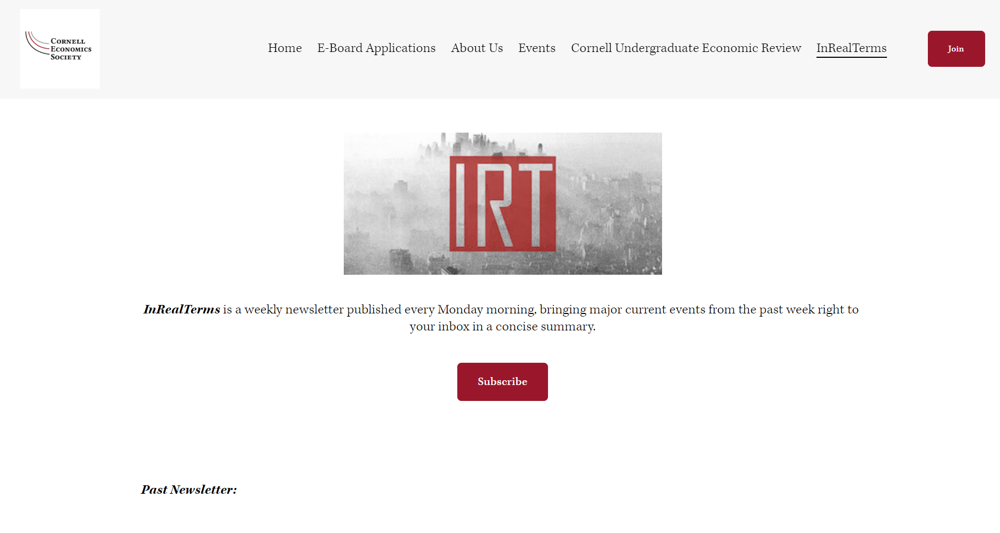

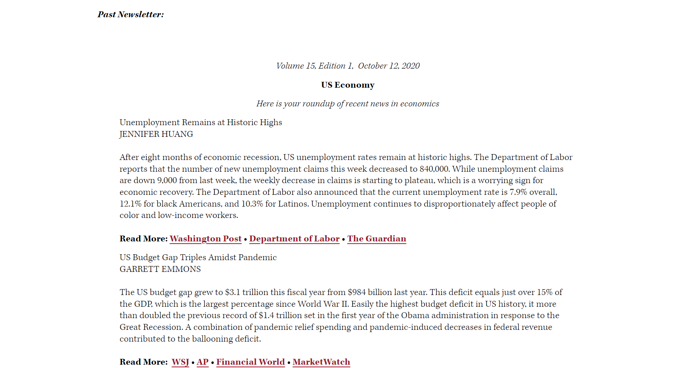

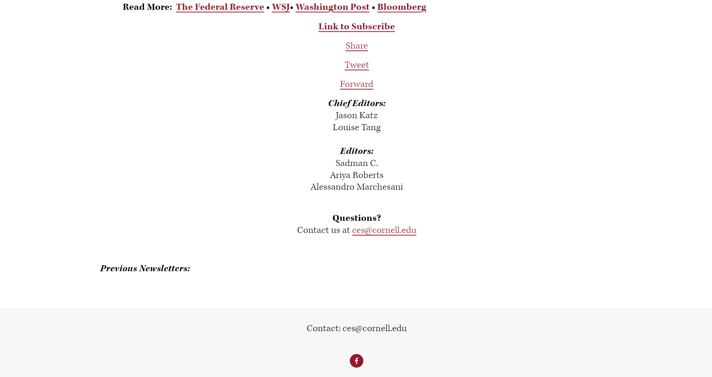

### Client Goals (Milestone 1)
> Identify your client's goals for the website.
> What kind of website do they want? What are their goals for the site?
> There is no required number of goals. You need as many goals as necessary to reflect your client's desires.

1. Digital Identity for IRT: Currently, the website operates under the umbrella of the Cornell Economics Society. The client expressed a desire to have a distinct digital space for IRT in order to easily showcase its work and facilitate audience engagement.

2. Increase Awareness: The client expressed interest in expanding the awareness of IRT on campus, specifically amongst the students interested in pursuing economic-related careers. He brought up that despite having more than 1,500 subscribers, it is not a well-known organization on campus. Thus, the client wants the website to promote IRT and attract more students to contribute to the newsletter.

3. Accessible Content: The client expressed the desire to have general information about IRT, and most importantly its most popular newsletters, be easily accessible. Nonetheless, he wants the website to be organized and easy to read. In addition, the client had a goal to make information about the people behind the club accessible (i.e., the board members, and/or writers).

4. Design aligns with mission: The client wants the website design, layout, and content to align with the organization’s mission and expectations for the club’s branding.

5. Competitive Digital Presence: The client suggested drawing inspiration from IRT’s competitors and similar organizations. They said it would help reach their goals of obtaining a clean, professional, and accessible digital presence to compete with the standards set by clubs such as The Cornell Daily Sun.

6. Emotional Resonance: The client wants the design of the website to emotionally connect with the visitors through professionalism, mission, and purpose. To do so, the client stressed the importance of the club to reflect the current economic events.

### Client Website Scope (Milestone 1)
> We want your project to be successful! It needs to be ambitious, but not too large.
> A good rule-of-thumb is that you should have about 1 content-full page for each team member.
> Explain why the website you will create for your client isn't too small and isn't too big.
> Explain why you think it's the right size for this project.

The proposed website is a balance between being ambitious and achievable. There will be 4 content-full pages, which will each be assigned to one of the four team members in this group. Thus, each member will be able to devote their full attention to making sure that the page they are creating is well crafted, informative, and aligns with the client’s goals/expectations. The scope encompasses creating a professional website to showcase everything behind IRT; hence, each page will be reserved to present an important topic within the club (i.e., general/background information and mission, IRT’s most important newsletters, the people behind the organization, and the avenues for interaction).

The website we will be creating for our client is not overly ambitious because we are using existing content from IRT’s current page. Nonetheless, it is not too small because it transitions content that is not well-organized into an easily usable and accessible website. Each page within the website we are designing will serve a small purpose, ultimately meeting all of the client’s goals.

The scope of the website aligns with the client’s goals to have a professional and organized digital presence in order to increase awareness about IRT amongst the Cornell community. Thus, the scope of this website will make it possible to put together a project that delivers a website that is user-friendly and meets all of the client’s goals.

## Plan/Schedule (Milestone 1)
> Make a plan of when you will complete all parts of this assignment.
> This plan is for your team. There is no required format. Format it so that it works for you!
> Your plan should include when you will interview users and analyze their goals.
> Your plan should also include how and when you will assemble/create the sit's content.
> **Tip:** Your team should plan to work ahead. This project really isn't feasible to complete the night before a deadline.

- Team Meeting #1: Tuesday, October 24 (6:15 PM - 7:15 PM)
  - Finish Team Contract
  - Discuss Client
  - Assign Roles
  - Work on Milestone 1 (Assign Sections)
- Client Meeting #1: Tuesday, October 24 (7:30 PM - 8:30 PM)
- Goal Analysis #1: Tuesday, October 24 (8:30 PM - 9:30 PM)
- Milestone 1: Wednesday, October 25 (3 PM; all parts complete)
- Milestone 1 Submission Due: Wednesday, October 25 (11:59 PM)
- Understanding Users (Milestone 2): Thursday, October 26 (11:59 PM)
- User Interview Questions (Milestone 2): Sunday, October 29 (11:59 PM)
- Interview #1 & Interview Notes (Milestone 2): Monday, October 30 (6:30 PM)
- Interview #2 & Interview Notes (Milestone 2): Thursday, November 2 (6:30 PM)
- Interview #3 & Interview Notes (Milestone 2): Friday, November 3 (6:30 PM)
- Goals (Milestone 2): Sunday, November 5 (11:59 PM)
- Audience (Milestone 2): Sunday, November 5 (11:59 PM)
- Website Design Exploration (Milestone 2): Sunday, November 5 (11:59 PM)
- Example Website 1 Review (Milestone 2): Sunday, November 5 (11:59 PM)
- Example Website 2 Review (Milestone 2): Sunday, November 5 (11:59 PM)
- Example Website 3 Review (Milestone 2): Sunday, November 5 (11:59 PM)
- Content Planning (Milestone 2): Sunday, November 5 (11:59 PM)
- Site's Planned Content (Milestone 2): Sunday, November 5 (11:59 PM)
- Content Justification (Milestone 2): Sunday, November 5 (11:59 PM)
- Content Organization (Milestone 2): Monday, November 6 (11:59 PM)
- Final Content Organization (Milestone 2): Monday, November 6 (11:59 PM)
- Navigation (Milestone 2): Monday, November 6 (11:59 PM)
- Visual Theme (Milestone 2): Monday, November 6 (11:59 PM)
- Design (Milestone 2): Monday, November 6 (11:59 PM)
- Interactivity Brainstorm (Milestone 2): Monday, November 6 (11:59 PM)
- Layout Exploration (Milestone 2): Tuesday, November 7 (11:59 PM)
- Final Design (Milestone 2): Tuesday, November 7 (11:59 PM)
- Design Rationale (Milestone 2): Tuesday, November 7 (11:59 PM)
- Interactivity Rationale (Milestone 2): Tuesday, November 7 (11:59 PM)
- Interactivity Plan (Milestone 2): Tuesday, November 7 (11:59 PM)
- Client Meeting #2: Wednesday, November 8 (6:30 PM)
- Client Feedback & Minutes (Milestone 2): Wednesday, November 8 (11:59 PM)
- Create Site’s Content (Milestone 2): Sunday, November 12 (11:59 PM)
- Milestone 2: Monday, November 13 (3 PM; all parts complete)
- Milestone 2 Submission Due: Wednesday, November 15 (11:59 PM)
- User Testing Tasks (Final Submission): Friday, November 17 (6:30 PM)
- Participant 1 (Final Submission): Sunday, November 19 (11:59 PM)
- Participant 1 -- Testing Notes (Final Submission): Sunday, November 19 (5:00 PM)
- Participant 2 (Final Submission): Sunday, November 19 (11:59 PM)
- Participant 2 -- Testing Notes (Final Submission): Sunday, November 19 (6:00 PM)
- Participant 3 (Final Submission): Sunday, November 19 (11:59 PM)
- Participant 3 -- Testing Notes (Final Submission): Sunday, November 19 (7:00 PM)
- Website Revision Based on User Testing (Final Submission): Monday, November 20 (11:59 PM)
- Final Submission: Tuesday, November 21 (3 PM; all parts complete)
- Final Submission Due: Wednesday, November 29 (11:59 PM)
- Lab 14 Show & Tell: Friday, December 1
- Peer Evaluations: Sunday, December 3 (11:59 PM)

## Understanding Users (Milestone 2)

**Make the case for your decisions using concepts from class, as well as other design principles, theories, examples, and cases from outside of class.**

You can use bullet points and lists, or full paragraphs, or a combo, whichever is appropriate. The writing should be solid draft quality, but it doesn't have to be fancy.

### User Interview Questions (Milestone 2)
> Plan the user interview which you'll use to identify the goals of your site's audience.
> You may use the interview template below and revise it as much as you desire.

**User Interview Briefing & Consent:** "Hi, I am a student at Cornell University. I'm currently taking a class on web design and for a project, I am designing the website for Joel Pang, the president of the IRT sub-organization of the Cornell Economics Society. I'm trying to learn more about the people that might use this site. May I ask you a few questions? It will take about 10 minutes. You are free to quit at any time."

1. Please tell me a bit about yourself. You may omit any personal or private information.

2. Recall the last time you visited an organization’s website. What on that site stood out to you?
   a. What did you like about it? What didn’t you like?

3. Walk me through your process of examining the last organization website you visited.
   a. Describe the navigation process. Which pages did you visit first?

4. When looking to join a new campus club or organization, do you seek out information about the organization before applying?
   a. If yes, what information were you specifically looking for? How did you access that information?

5. Is there any information that you feel is often missing or underrepresented by your sources?

6. Can you recall a time when you faced challenges or difficulties when trying to find information about a Cornell club? What were the challenges or difficulties you faced?

7. Recall a Cornell club you wanted to be a part of but did not end up joining. What factors kept you from participating?

8. What is your relationship with IRT?

9.  How did you learn of IRT?

10. What were your intentions when you originally sought to learn more about IRT?

11. What would you be most interested in knowing about IRT?

12. What do you consider the most valuable resources offered by IRT?

13. What haven't I asked you today that you think would be valuable for me to know?

**After the interview:** "This was really helpful. Thank you so much for agreeing to speak with me today. Have a great day!"

<cite>Interview Questions</cite> by Group Members.

### Interview Notes (Milestone 2)
> Interview at least 1 person for every member of your team from your audience.
> Take notes and include those notes here. Make sure to include a brief description of each interviewee.
> **Copy the interview questions above into each interviewee section below.**
> Take notes for each participant **inline** with the questions.

**Interviewee 1:**

Participant Information: My participant is currently a Senior studying Business Administration with a concentration in Economics. He has always had a passion for anything that has to do with Economics, anywhere from writing to website design. Thus, he has taken numerous classes that have driven him to pursue his career goals and passion. He is originally from Miami, Florida, and hopes to return to Miami to begin his professional career.

User Interview Briefing & Consent: "Hi, I am a student at Cornell University. I'm currently taking a class on web design and for a project, I am designing the website for Joel Pang, the president of IRT. I'm trying to learn more about the people that might use this site. May I ask you a few questions? It will take about 10 minutes. You are free to quit at any time."

1. Please tell me a bit about yourself. You may omit any personal or private information.
- My name is Ilan. I am currently a Senior studying Business Administration with a concentration in Economics. I am originally from Miami, Florida.

2. Recall the last time you visited an organization’s website. What on that site stood out to you? What did you like about it? What didn’t you like?
- The last time I visited an organization’s website was yesterday when I checked out AIPAC. What stood out to me was the use of images that made it clear that everyone involved in the organization was committed to helping Israel. As soon as I opened the website the images, on the home page, made their mission really clear to me. Thus, I liked that the website’s content was very cohesive; everything (i.e., typography, imagery, color, etc) was making their mission statement evident. As I learned in my digital marketing class, the webpage content is designed in a Z-shape pattern, which makes it very easy to read and digest the information. That being said, there is nothing that I did not like about the website.

3. Walk me through your process of examining the last organization website you visited. Describe the navigation process. Which pages did you visit first?
- The first thing I did when opening the AIPAC website was scroll through the home page and read the content. As I previously said, I liked the Z-shape pattern they implemented; I also like how it gave a general overview of the website’s content, and gave you the option to click on a button at the end of the short description, if you wanted more information. Since I was just trying to find general information about the organization, after the home page, I navigated to the About Page; again, I scrolled down to the bottom of the page. On this page, I found all the information I was looking for. Nonetheless, I continued navigating through the pages quickly: Policy, Resources, and AIPAC PAC.

4. When looking to join a new campus club or organization, do you seek out information about the organization before applying? If yes, what information were you specifically looking for? How did you access that information?
- If I have an interest in joining a club or organization, I will reach out to friends who know information about the club/organization to find out information on whether or not the club is worth joining. If they tell me it is, I will usually visit the organization’s website for more specific information about the application process, activities offered, benefits of joining, and day-to-day tasks. Nonetheless, if my interest in joining comes at the start of the semester, I will usually just attend Club Fest and ask questions there, usually focused on the club’s time commitment and application process, as I previously mentioned.

5. Is there any information that you feel is often missing or underrepresented by your sources?
- Yes, when getting advice from a peer you have to take it with a grain of salt because everyone has their own perspective on a club. Also, when obtaining information from an organization’s website you usually only see the positives of the club; I would like to see more information on frequently asked questions for example the time commitment, the application process, and the benefits of being a member.

6. Can you recall a time when you faced challenges or difficulties when trying to find information about a Cornell club? What were the challenges or difficulties you faced?
- Yes, I was interested in joining the Cornell Daily Sun this semester, but I did not find any information (other than the previously written articles) on their website. I think it’s important for clubs and organizations to have information about their meeting dates and times (i.e., time commitment) as well as how to join.

7. Recall a Cornell club you wanted to be a part of but did not end up joining. What factors kept you from participating?
- I did not end up joining the Cornell Daily Sun because of the lack of clarity surrounding their expectations. I had a lot of difficulty finding their meeting times and dates on their website. Nonetheless, I reached out to one of my friends, on their Slack channel, who was able to tell me where to go for the meetings. Once I was there, I did not get my questions answered, and I was unable to find them on their website. I have a lot of high-commitment work, due to my class schedule, and I wish I was able to find more specifics on their website so that I do not feel lost or like I have fallen behind if I am unable to attend every meeting.

8. What is your relationship with IRT?
- I am currently not in IRT, but because of my major, I have heard a lot of people talk about it. A few months ago, I looked at their website to try to find some articles to read. Although I was able to find interesting articles, their website was really hard to navigate.

9. How did you learn of IRT?
- I learned about IRT through my friends because a lot of them are interested in reading Economics-related articles. Nonetheless, none of them are currently involved in writing the articles.

10.  What were your intentions when you originally sought to learn more about IRT?
- My intention when I originally sought to learn more about IRT was just to understand the purpose of the club. I had heard many people talk about it, so I was just interested in knowing more about the club’s mission and purpose. When I visited their website initially I noticed that they were focused on writing articles about economics; thus, now, when I visit their website it is usually to read their articles, since they are usually very interesting.

11.  What would you be most interested in knowing about IRT?
- I would be interested in knowing more about their article writing process. For example, if there are any training sessions you must attend before writing, how people select the writing topics, if there is a word limit, etc.

12.  What do you consider the most valuable resources offered by IRT?
- I think the most valuable resources are the articles that are produced by them. Nonetheless, in terms of member benefits, I was not able to find specific information on their website. Despite this, I would like to know if there are benefits and opportunities that may arise by being a member and writer for IRT.

13. What haven't I asked you today that you think would be valuable for me to know?
- If there is any help I can provide through the website design process please let me know. In my digital marketing class, I was tasked with going through a website and analyzing the aspects of the design, in terms of the target audience, to see if it met the marketing design principles. Thus, I am quite familiar with this process and might be able to provide a valuable perspective.

After the interview: "This was really helpful. Thank you so much for agreeing to speak with me today. Have a great day!"

<cite>Interviewee 1</cite> by Ingrid Gruener.

**Interviewee 2:**

Participant is a sophomore in ILR interested in going into finance after university.

1. Please tell me a bit about yourself. You may omit any personal or private information.
Sophomore at Cornell University originally from Boston. Interested in finance as well as tennis and basketball.

2. Recall the last time you visited an organization’s website. What on that site stood out to you?
   a. What did you like about it? What didn’t you like?
What stood out to me was the clean and modern design of the homepage. The use of high-quality images and a well-organized layout immediately captured my attention. What stood out to me was the clean and modern design of the homepage. The use of high-quality images and a well-organized layout immediately captured my attention. While the overall experience was positive, one drawback was the lack of a search bar on the homepage. It would have been more convenient to have a quick search option for specific information. Additionally, some pages took a bit longer to load, which affected the overall speed and responsiveness of the site.

3. Walk me through your process of examining the last organization website you visited.
   a. Describe the navigation process. Which pages did you visit first?
I began by exploring the homepage to get an overview of the organization. From there, I navigated to the "About Us" page to learn more about the company's history and values. Afterward, I visited the "People" section to explore what they offered in more detail. Finally, I checked out the "Contact" page to find information on how to get in touch with the organization.

4. When looking to join a new campus club or organization, do you seek out information about the organization before applying?
   a. If yes, what information were you specifically looking for? How did you access that information?
I look for information such as the club's mission and goals, the activities they organize, meeting schedules, membership requirements, and any notable achievements. Usually on the website and social media.

5. Is there any information that you feel is often missing or underrepresented by your sources?
No

6. Can you recall a time when you faced challenges or difficulties when trying to find information about a Cornell club? What were the challenges or difficulties you faced?
Outdated or incomplete information on the club's official platforms. In such cases, I found it challenging to get accurate details about the club's current activities, leadership, or meeting times.

7. Recall a Cornell club you wanted to be a part of but did not end up joining. What factors kept you from participating?
Scheduling conflicts with other commitments and a lack of clarity about the club's goals and activities. Also, personal reasons such as feeling a lack of connection with the current members or not aligning with the club's values.

8. What is your relationship with IRT?
None, just heard about it.

9. How did you learn of IRT?
Through the CES website.

10. What were your intentions when you originally sought to learn more about IRT?
I was interested because I have a keen interest in economics and as such was looking at potential clubs or organizations that I could join.

11. What would you be most interested in knowing about IRT?
The mission and the initiatives been rolled out that will benefit the general Cornell populace.

12. What do you consider the most valuable resources offered by IRT?
The information from the newsletter.

13. What haven't I asked you today that you think would be valuable for me to know?
None.

<cite>Interviewee 2</cite> by Elaine Wu.

**Interviewee 3:**

1. Please tell me a bit about yourself. You may omit any personal or private information.

- Sophomore at Cornell
  - Information science major
    - Intends to go into tech policy and eventually study law

2. Recall the last time you visited an organization’s website. What on
   2a. that site stood out to you? What did you like about it? What didn’t you like?

- Visited the Oar Tompkins County website
  - Information was insightful
  - The website was well-constructed
  - Professional
  - Cohesive design
  - Not formatted well
  - Information was not easily found
  - Required searching to find basic information

3. Walk me through your process of examining the last organization's website you visited.
  3a. Describe the navigation process. Which pages did you visit first?

- Entered the site via the homepage
  - Scrolled through the homepage, looking for information
  - Went to the services page
  - Then, the housing page

4. When looking to join a new campus club or organization, do you seek out information about the organization before applying? If yes, what information were you specifically looking for? How did you access that information?

- Yes
  - What they look for
    - Club values
    - Organization purpose
    - Recruitment process
    - Club members
    - What does the organization do?

5. Is there any information that you feel is often missing or underrepresented by your sources?

- No

6. Can you recall a time when you faced challenges or difficulties when trying to find information about a Cornell club? What were the challenges or difficulties you faced?

- Many of the Cornell clubs do not have their own websites and instead have a page on one of the cub platforms
- makes it extremely difficult to find information about them.

7. Recall a Cornell club you wanted to be a part of but did not end up joining. What factors kept you from participating?

- Wanted to join one of the competitive clubs
  - Interviewed with them but got cut
- Other more important commitments

8. What is your relationship with IRT?

- Is a writer for IRT

9. How did you learn of IRT?

- Friends with a writer and the club president

10. What were your intentions when you initially sought to learn more about IRT?

- Wanted to join IRT for a while
  - Aligns with major and goals for career
  - Did not get to join until recruitment began

11.  What would you be most interested in knowing about IRT?

- As a writer
  - Don’t know how topics are picked to be written about
  - Would like to know how these topics are picked

12.  What do you consider the most valuable resources offered by IRT?

- The website is extremely important
  - The way users can sign up to the newsletter
  - This drives the club and keeps it going

13. What haven't I asked you today that you think would be valuable for me to know?
- nothing

<cite>interview 3</cite> by Edward Conte

**Interviewee 4:**

1. Please tell me a bit about yourself. You may omit any personal or private information.
- I am a current Junior studying Business Administration with a concentration in Economics.

2. Recall the last time you visited an organization’s website. What on that site stood out to you? - What did you like about it? What didn’t you like?
- The last time I visited someone's website was probably a few weeks ago when I saw a flyer up in the hallway and I wanted to know more about the organization, but I don’t remember which organization it was for. The images and very detailed graphics the organization decided to include stood out to me, and the front page included very helpful information. I didn’t like the transition the website had, like certain images would load into the page weirdly and it took a long time to show or would only show when I scrolled to a certain part. I did like how neat the website was, how helpful the information on the front page was; I enjoy when websites have easy navigators.

3. Walk me through your process of examining the last organization website you visited. Describe the navigation process. Which pages did you visit first?
- I clicked on the link, scrolled through the front page, went to the navigator, looked at the about page, specifically the contact us portion, went to the alumni section, and then went back to home.

4. When looking to join a new campus club or organization, do you seek out information about the organization before applying? If yes, what information were you specifically looking for? How did you access that information?
- If I have an interest in joining a club or organization, I tend to mostly seek out information pertaining to requirements and time commitment. I would ask if the person is there or I would visit their page online and go to contact and click on whoever would be in the role to answer questions about the org.

5. Is there any information that you feel is often missing or underrepresented by your sources?
- Not really.

6. Can you recall a time when you faced challenges or difficulties when trying to find information about a Cornell club? What were these challenges or difficulties you faced?
- One time I was not able to find where the club was meeting because they had the wrong location and that made it really hard for me to find them on campus to meet. Even the emails they would send had the wrong location.

7. Recall a Cornell club you wanted to be a part of but did not end up joining. What factors kept you from participating?
- Time commitment is a big factor that keeps me away from joining particular clubs, or if it's hard to find information about the club I probably will not join.

8. What is your relationship with IRT?
- IRT is a website I look out every so often to see what is going on because of my major. It is not my main source of news but I do find my self scrolling on it to find some stuff that is going on.

9. How did you learn of IRT?
- I learned about IRT through a friend who is also interested in checking out the website for interesting articles.

10. What were your intentions when you originally sought to learn more about IRT?
- I wanted to know what was IRT about. It seemed really interesting to me the way a friend explained what it was so I wanted to experience this for myself.

11. What would you be most interested in knowing about IRT?
- I would be interested to know more about what goes into their process of article topics and what goes into being a part of IRT in general.

12. What do you consider the most valuable resources offered by IRT?
- I think the most valuable resources are their articles because those seem to be what has attracted me and my friends to IRT overall.

13. What haven't I asked you today that you think would be valuable for me to know?
- Nothing.

<cite>Interview 4</cite> by Autumn Kretzschmar.

### Goals (Milestone 2)
> Analyze your audience's goals from your notes above.
> List each goal below. There is no specific number of goals required for this, but you need enough to do the job (Hint: It's more than 1 and probably more than 2).

**Goal 1: Obtain Comprehensive Club Information**

- Design Ideas and Choices:
  - To meet this goal, the website will contain a dedicated page focused on providing information about the club. This section will include detailed descriptions of the club’s mission, values, and more related content. The ‘About’ page will provide a clear understanding of what the club does and stands for. In addition, we will include a Frequently Asked Question section to cover common queries.

- Rationale & Additional Notes:
  - The reason for the design choice detailed above is to provide website visitors with a clear overview of the club; thus, this will not only allow students to participate in the club if interested, but it will also allow them to learn more about the offerings at Cornell in Economics, their field of interest. This section, in turn, aligns with the need for detailed and easily accessible information about the club, as indicated by the interviewees.
  - Providing information about the club on the club’s website is critical for students who are not only exploring their interests but are also looking for groups that align with their academic and career aspirations. This comprehensive approach helps in making informed decisions about joining the club. It also addresses a key frustration highlighted in the interviews regarding the lack of detailed club information.

**Goal 2: Access Past Newsletters/Publications**

- Design Ideas and Choices:
  - To meet this goal, the website will include a dedicated section for newsletters/publications. Specifically, this section will solely feature a few past issues. On this same page, the website will provide the audience with an easy sign-up option for the newsletter.

- Rationale & Additional Notes:
  - By offering sample newsletters for non-subscribers to view, the website is not only providing users with the economics-related content they seek but also encouraging them to sign up for the newsletter. Not to mention, providing users with sample content can engage visitors, motivating them to browse the website for a longer period of time, while also giving them a taste of the club’s regular communications and insights in case they are interested in becoming a writer.
  - Providing this content not only engages visitors but also establishes a trust factor, showcasing the club's commitment to regular, quality writing.

**Goal 3: Obtain E-Board Information**

- Design Ideas and Choices:
  - To meet this goal, the website will have a section dedicated to E-Board information. On this page, users will be able to find the profiles of current members, their roles, and contributions to the club. In addition, this section will highlight the experiences that these board members have had as a result of their involvement in the club. Finally, in this section, the audience will be able to access a QR code that will take them to the E-Board Application, along with answers to frequently asked questions about the application process and time commitment.

- Rationale & Additional Notes:
  - Personalizing the website with member information can help new visitors connect with the club. Additionally, after conducting the interviews, it was made clear that the audience members wanted to understand the benefits and experiences of joining the club.
  - Providing detailed E-Board information adds a human element to the club's website, making it more relatable and approachable. This section can also serve as a guide for those aspiring to join the club's E-Board in the future.
  - The inclusion of a QR code for the E-Board application simplifies the application process.

**Goal 4: Clear Navigation and User-Friendly Design**

- Design Ideas and Choices:
  - To meet this goal, the website will feature a user-friendly interface with clear, intuitive navigation. Specifically, the website will make use of a structure that is commonly found across the web. Thus, we will consider using a Z-shape pattern layout for content. This will ensure that information about the club, membership details, newsletters, and member profiles is easily accessible.

- Rationale & Additional Notes:
  - In the interviews, interviewee 2 stressed the importance of a well-structured website with easy navigation. He said that he has encountered numerous websites, especially for Cornell clubs, where he can’t find the information he is looking for. He added that the use of Z-shaped patterns for content made it easier to read and consume. All in all, addressing this goal is crucial for a positive user experience and for ensuring that visitors can find the information they need quickly.
  - This approach is directly informed by user experiences shared during the interviews and is integral to making the website accessible and engaging

**Goal 5: Facilitate Engagement with IRT**

- Design Ideas and Choices:
  - In order to make it easier for the audience members to engage with the content produced by IRT, the website will integrate social media links and a newsletter sign-up; in turn, this will enhance digital outreach, positively affecting the club.

- Rationale & Additional Notes:
  - The members of IRT stressed the importance of increasing the club's visibility and attracting potential new members or readers. Thus, integrating social media will do a great job of accomplishing this goal.
  - This strategy is particularly important in a university setting where students often rely on digital channels for information.

<cite>Goals</cite> by Ingrid Gruener.

### Audience (Milestone 2)
> Briefly explain your site's audience.
> Be specific and justify why this audience is a **cohesive** group with regard to your website.

- Site's Audience: Cornell students who are interested in exploring the field of economics by engaging in reading and/or writing.

- Cohesive: Cornell students who are interested in exploring the field of economics by engaging in reading and/or writing form a cohesive group for numerous reasons. To begin, the target audience members have a common interest in economics, which is a broad yet specific field of study. Thus, this shared interest creates a natural basis for the content that is relevant to the website. Nonetheless, since the specific group of students that were selected were those that attend Cornell University, it is likely that the audience members are academically driven and intellectually curious. This trait builds on the cohesive nature of the audience members as the website aims to offer thought-provoking content in the field of economics. Not to mention, the fact that the audience members are all part of the Cornell community makes it easier to tailor content that is relevant to their academic and social setting, such as economics-related global issues that are impacting the Cornell community. That being said, the fact that the audience group includes those who are both interested in reading and writing allows for the website to value diversity of contribution. The audience’s focus on diverse learning methods, in turn, caters to those who value a different style of engaging in economics-related content whether that be through consuming knowledge or producing it. Similarly, the emphasis on reading and writing aligns with individuals who are interested in developing their comprehension, analysis, and communication skills, which are some of the most fundamental skills in a field like economics.

<cite>Audience</cite> by Ingrid Gruener and Edward Conte

## Website Design Exploration (Milestone 2)

Identify three websites (preferably static websites) that exist today on the web to draw inspiration from. Please select websites that are similar to the website you wish to create.

Include two screenshots of the home page for each site: narrow and wide.

**Redesigning the following website:**
1. <https://www.cornelleconomicssociety.com/inrealterms>

    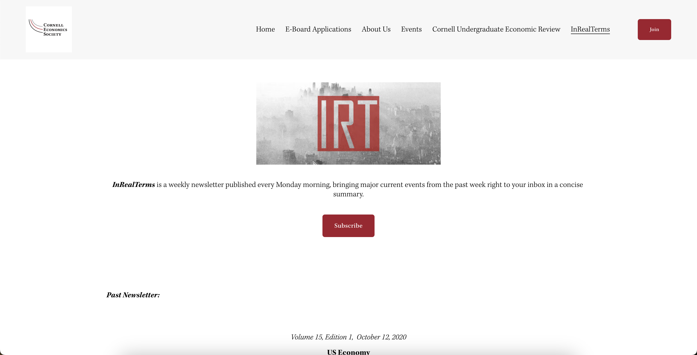

    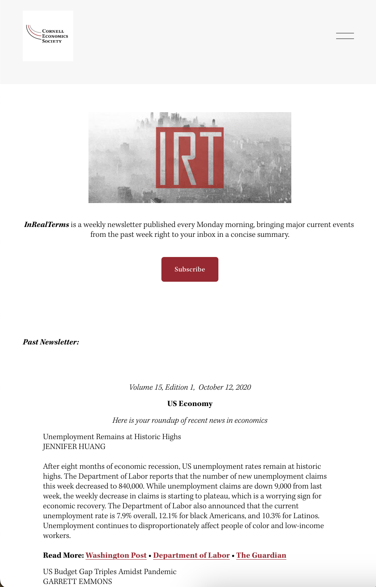

**We'll refer to these are your "example websites."**

1. <https://www.cornelluxdesign.com/>

    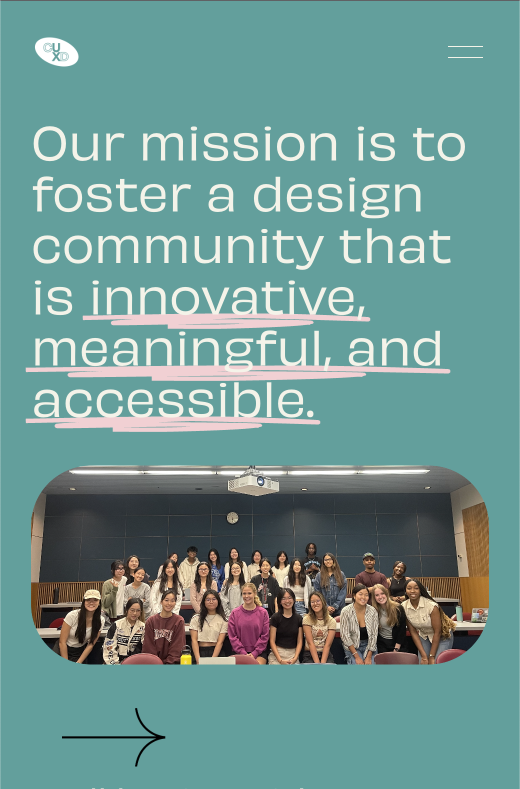

    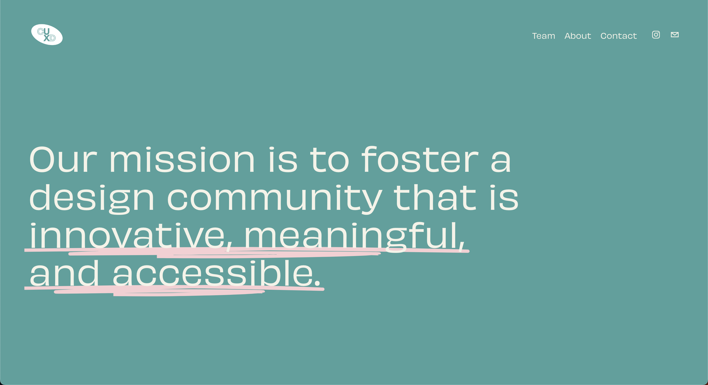

2. <https://cornellsun.com/>

    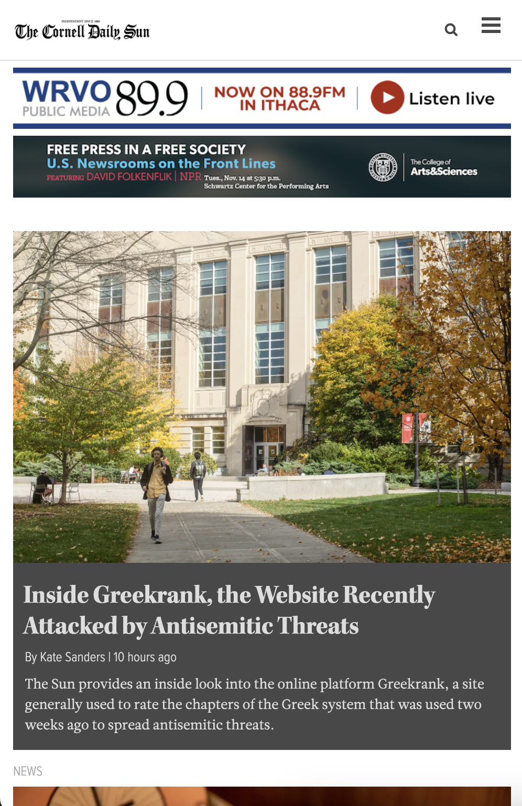

    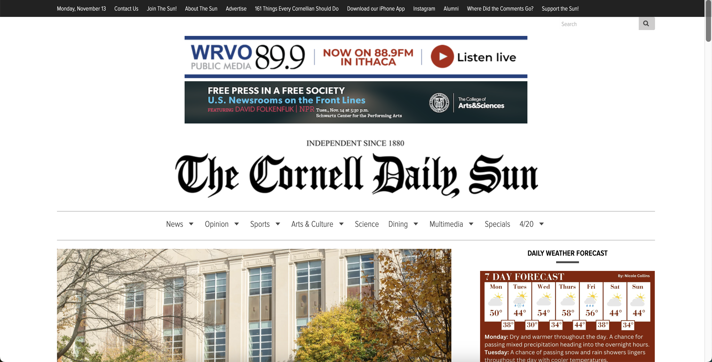

3. <https://www.cornellappdev.com/>

    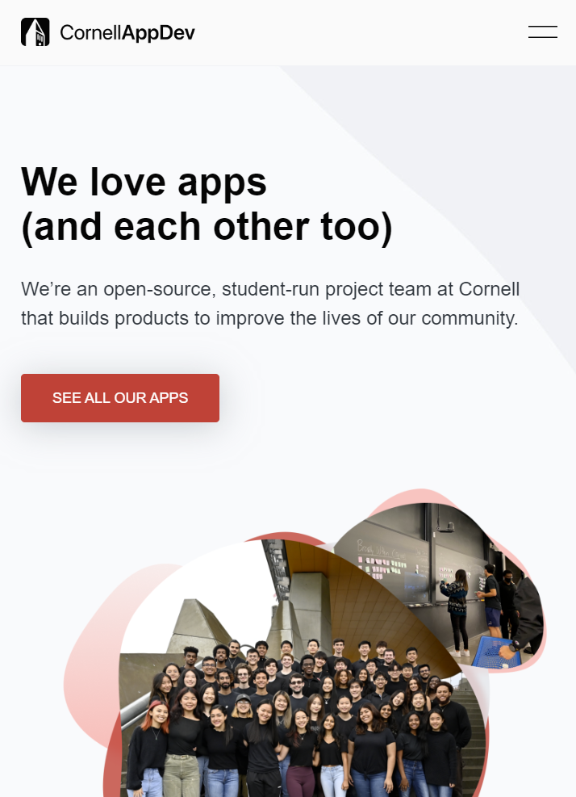

    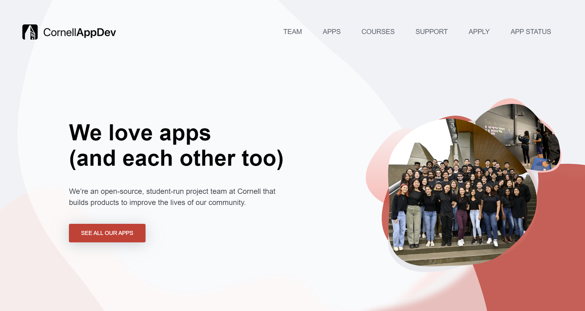

### Example Website 1 Review (Milestone 2)
> Review the website you identified above. (1 paragraph)
> In your review, include a discussion common design patterns and interactivity in the site.

This website follows common design patterns while adding unique elements to improve the site's visual aesthetic. The colors of the site are cohesive and indicative of the site’s primary audience and topic.  A navigation bar exists on all pages within the site: about, team, and contact. When a device is displaying the site in a wide browser window, these pages are displayed to the right of the site logo within the header. If the browser is resized to examine the narrow layout, the navigation bar is hidden, and instead, the user is prompted to click a hamburger menu, which expands to fill the entire window. The content on this site is divided into four pages, each featuring images within shapes alongside informative text. The homepage consists of the club's mission and quick information about what they do. The text is short and concise, a common trend within this site. A team page lists the members of the club e-board, informative and important for new members. The contact page primarily consists of a contact form that site users may fill out. His contact form is prevalent throughout the site, with a link at the bottom of each page.

<cite> Example Website 1 Review </cite> by Edward Conte.

### Example Website 2 Review (Milestone 2)
> Review the website you identified above. (1 paragraph)
> In your review, include a discussion common design patterns and interactivity in the site.

The Cornell Daily Sun website design follows the common design patterns and interactivity principles typical of modern news websites. As soon as the website is opened, the user sees a navigation bar at the top of the screen (and a hamburger menu in the narrow screen version) that includes links to different sections such as News, Opinion, Sports, Arts & Culture, Science, and Dining; the clear label, along with the location of the navigation bar facilitates easy access to various content areas. Nonetheless, a weakness that this website presents arises due to the fact that there are two navigation bars, the one that was detailed above and a global navigation bar – that is extremely narrow and small – all the way at the top of the website. When the widescreen layout turns into a narrow screen layout, the global navigation bar conflates with the normal navigation bar, forming the hamburger menu. That being said, the website adapts to different screen sizes, ensuring a user-friendly experience across devices. In addition to the navigation components, the content is well-structured, with the most important articles beginning on the home page. These articles are solely displayed with titles – in the form of buttons – giving the users the option to continue reading the ones they are interested in. Nonetheless, there is some extraneous information on the home page aside (i.e., weather, and advertisements) that distracts the user from the relevant content. Despite this, when the widescreen version is turned into a narrow screen version, the content becomes vertically stacked, the aside goes to the bottom of the screen, and the most relevant content is found toward the top. On every page of the screen, in both the widescreen version and the narrow screen version, the website contains a footer that occupies the entire width of the screen. This footer not only houses copyright information, but also their social media platforms as well as their contact information, email subscription, application download link, publication calendar, staff list, and much more. Although this website has numerous strengths, it lacks interactivity components, which may be used to entice users to browse for a longer period of time.

<cite>Example Website 2 Review </cite> by Ingrid Gruener.

### Example Website 3 Review (Milestone 2)
> Review the website you identified above. (1 paragraph)
> In your review, include a discussion common design patterns and interactivity in the site.

The design for both wide and narrow screens follows many familiar design patterns that were outlined in lectures, such as a distinctive header at the top where the logo, title, and navigation bar exists. For both wide and narrow screens, the logo and title appears on the left of the header, and for the wide screens, the navigation bar is on the right. Meanwhile, for narrow screens, there is a hamburger menu on the right, and when interacted with, a navigation menu appears. The home page also uses buttons at the end of the text in certain subsections that the user can click and navigate to other pages. For each page on the site, for wide screens, it uses rows of images and text to fully use the available space, but for narrow screens, all of the content is stacked vertically and media stretches the entire width of the screen. At the bottom of every page, the site has a footer that stretches the entire width of the screen. Additionally, the website employs interactivity with a thumbnail gallery and modals near the bottom of the home page where the user can click on thumbnails of images and a modal pops up that enlarges the clicked on image.

<cite>Example Website 3 Review </cite> by Elaine Wu.

## Content Planning (Milestone 2)

Plan your site's content.

### Your Site's Planned Content (Milestone 2)
> List **all** the content you plan to include your website.
> You should list all types of content you planned to include (i.e. text, photos, images, etc.)
> Briefly summarize the content; do not include the content here.

- Image: IRT Logo
- Text: IRT Background Information
- Text: IRT Mission/Values
- Text: E-board members’ Names, Majors, and Colleges
- Text: E-board experiences
- Photos: E-board members’ photos
- Text: Writers’ Names
- Text: Editors’ Names
- Text: Example Newsletter
- Text: Information on Joining the Club
- Text: Information About the Writing Process
- Text: Frequently Asked Questions
- Text: Contact Information (Link to Email)
- Text: US Unemployment
- Text: Pandemic US Budget Gap
- Text: Federal Reserve Bond Purchasing
- Text: Trump’s Decision
- Text: Jerome Powell’s Remark
- Image: Unemployment
- Image: Pandemic
- Image: Money
- Image: Trump
- Image: Jerome Powell
- Text: UK Economic Decline
- Text: Cornell Compliance Message
- Image: UK Economy
- Link: Newsletter Subscription
- Image: QR code for E-board Application
- Image: Twitter Icon
- Image: Facebook Icon
- Link: Twitter
- Link: Facebook

<cite> Your Site's Planned Content </cite> by Ingrid Gruener and Edward Conte

### Content Justification (Milestone 2)
> Explain (about a paragraph) why this content is the right content for your site's audience and how the content addresses their goals.

This proposed content perfectly aligns with the interests and needs of Cornell students exploring economics, offering a comprehensive view of the IRT club and its activities. By including detailed background information, mission/values, and profiles of E-board members, the site becomes a valuable resource for those seeking insight into the club's ethos and leadership. This approach is particularly effective for students considering joining the club, as it provides a transparent view of who is involved and what their experiences have been. Additionally, the inclusion of past newsletters and information on the writing process addresses the audience's academic and professional interests in economics. This content not only serves as a resource for current economic topics, such as the US unemployment rate, the pandemic’s impact on the budget, and decisions by influential figures like Jerome Powell and Donald Trump but also encourages active participation and engagement through the writing and editorial process. Furthermore, the user-friendly design and clear navigation of the website cater to the need for easy access to information, as highlighted in our interviews with Cornell students. The integration of social media links and newsletter sign-ups supports the goal of facilitating engagement with IRT, effectively enhancing the club's visibility and outreach.

<cite> Content Justification </cite> by Ingrid Gruener.

## Information Architecture (Milestone 2)

### Content Organization (Milestone 2)
> Document your **iterations** of card sorting here. You must have at least 2 iterations of card sorting.
> Include photographic evidence of each iteration of card sorting **and** description of your thought process for each iteration.
> Please physically sort cards; please don't try and do this digitally.

**Card Sorting Iteration 1:**
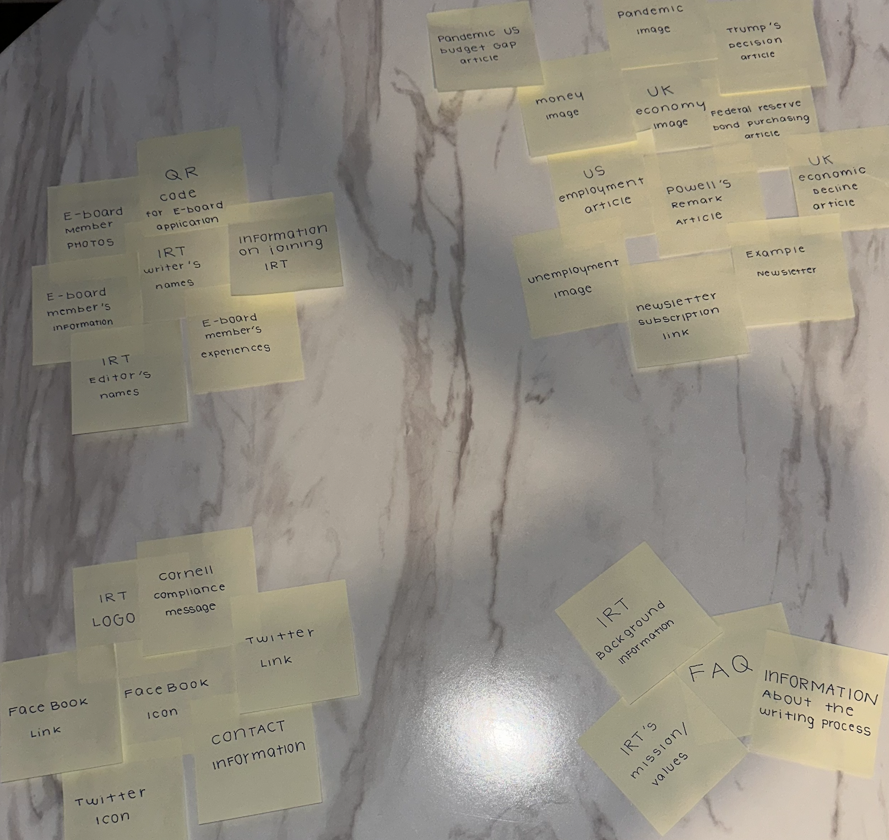

Explanation: For the first card sorting iteration, I took a user-centric approach. Thus, the content is organized in a comprehensive way for the target audience to easily access the information they desire. To begin, the first cluster includes links and content (i.e., Facebook link, Twitter link, and contact information) that will allow the user to engage with the club’s offerings without any limitations. The next cluster includes information about IRT, such as background information, the mission and values, frequently asked questions, and general information about the writing process. The third cluster focuses on providing the website visitors with content in regard to past publications/newsletters; thus, this section will not only feature the example newsletters but also give the audience members a chance to subscribe to the newsletter (through a link) if they are interested in engaging with similar content in the future. Finally, the last cluster provides website visitors with everything they need to know about the E-Board; hence, this section includes information about the current board members, a QR code for IRT, and more related information. For each cluster, the images and pictures aimed to complement the text, by providing visuals for the content being described.

**Card Sorting Iteration 2:**
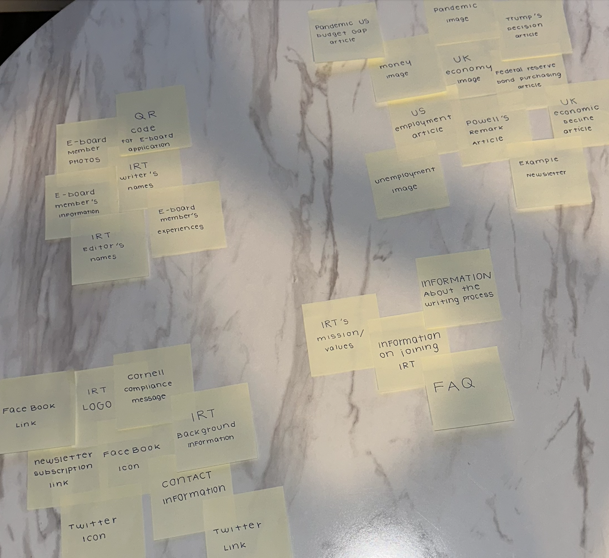

Explanation: When analyzing the card sorting for the first iteration, I noticed there were a few cards that were placed in clusters where they were not completely relevant. Thus, the second card sorting iteration builds on the first iteration in order to be sure that the content is organized in the best way for the target audience. Specifically, the first cluster not only includes content that allows website visitors to interact with IRT but also includes background information about IRT. Including background information about an organization or club on the home page of their website is vital because, evidently, not everyone who visits the website is going to be completely familiar with the club and for them to fully engage in the website’s offerings they have to have a clear understanding of what to expect. In addition to this change, the newsletter subscription link was added to the home page. The second card cluster contains the necessary information to further understand what IRT stands for; therefore, the content that was chosen for this page includes information about joining IRT, their mission and values, frequently asked questions, and information about the writing process. The third card-sorting group has content that has to do with the past example newsletters that visitors can use to obtain a comprehensive understanding of what IRT’s publications customarily entail. The final cluster provides website visitors with information about the E-board, including insights on the current members and the application process.

**Card Sorting Iteration 3:**
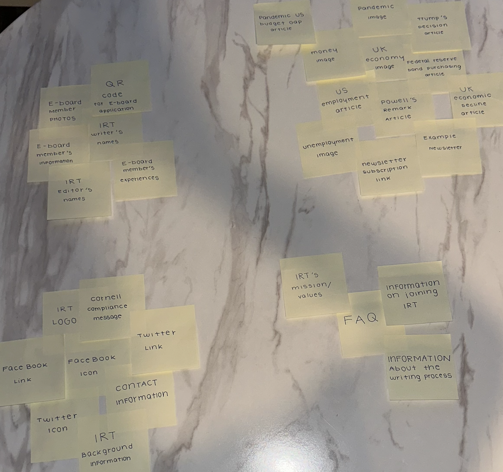

Explanation: The primary objective of the final card sorting iteration is to refine and confirm the organization established in the previous iteration, ensuring the content is optimally structured for the target audience: Cornell students with an interest in economics. Upon reviewing the previous iteration, it became clear that the arrangement was almost ideal, except for the placement of the newsletter subscription link. That is because our audience may not be familiar with the content customarily featured on IRT’s newsletters. To facilitate easier access and encourage subscriptions, the decision was made to position the newsletter subscription link on the same page as past newsletters. This approach allows users to engage in previous publications and, if they find them engaging, to subscribe immediately. This placement is intended to prevent the need for additional navigation or the potential loss of subscription opportunities due to inconvenience.

<cite> Content Organization </cite> by Ingrid Gruener.

### Final Content Organization (Milestone 2)
> Which iteration of card sorting will you use for your website?

The third card sorting iteration will be implemented.

> Explain how the final organization of content is appropriate for your site's audiences.

The third card sorting iteration was established after meticulously refining the content organization to best suit the target audience – Cornell students interested in economics. That being said, the organization featured in the third card-sorting iteration will enhance user experience because it ensures that the content is intuitively accessible to the audience.

Specifically, this card-sorting iteration addresses the specific needs and goals that the audience members revealed during the interview process. To do so, the key improvements that were made included strategically placing the newsletter subscription link, wherein users would be encouraged to look through past publications prior to subscribing. This change was made after realizing that not all audience members might be familiar with IRT’s newsletters. Therefore, placing the subscription link alongside past newsletters facilitates a seamless experience where users can explore previous issues and easily opt to subscribe if interested. All in all, this card sorting iteration effectively meets all the audience goals identified above.

<cite> Final Content Organization </cite> by Ingrid Gruener.

### Navigation (Milestone 2)
> Please list the pages you will include in your website's navigation.

- Page 1: Home
- Page 2: About Us
- Page 3: Newsletter
- Page 4: E-Board

> Explain why the names of these pages make sense for your site's audience.

The names of the pages for the IRT website are tailored to the interests and needs of the target audience. To begin, the ‘Home’ page allows for an intuitive user experience. That is because the home page is a page that is customarily used, and labeled, across the majority of websites on the internet. Specifically, like most home pages, the one on this website will provide an overview of what to expect as users navigate through the website. On the home page, users are also able to find contact information and more content that allows them to engage with IRT’s offerings. Thus, after looking through the home page, the users will be able to know where to navigate to find more detailed information, aligning with the goals of providing comprehensive club information and facilitating engagement.

The ‘About Us’ page will allow the audience members to fully understand what IRT has to offer in order for them to be able to join this club if it aligns with their academic and career interests. Specifically, this page will provide information about the mission and the values of the club. In addition to this, the page will feature information on how to join the club and how to become a writer. Thus, this page meets the goal of providing comprehensive information about the club to the audience members.

The ‘Newsletter’ page is clearly labeled for the target audience. Specifically, the audience members are interested in writing or engaging with economics-related writing so, through this label, they will be able to find the information they are looking for easily, meeting one of their goals. Not to mention, for students interested in economics news, accessing past newsletters and publications is valuable. Therefore, this page not only allows access to past publications – Goal 2 – but also encourages engagement through newsletter sign-up and writer applications.

The final page is labeled ‘E-Board’. This name is relevant because Cornell students – the target audience – know that E-Board is short for executive board, or leadership positions, in clubs. Hence, if they are interested in knowing who is behind the club they will navigate to this page which can, in turn, motivate students to join the E-board and write for IRT. Here, audience members can also find a QR code, which will lead them to the E-board application. Therefore, this section of the website aligns with goal 3 because it provides E-Board information. Overall, the labels and structure of the website’s pages make it easy to navigate, accomplishing goal 4. Thus, this website’s structure is strategically designed to engage the target audience, aligning with their goals and interests.

<cite> Navigation </cite> by Ingrid Gruener.

## Visual Theme (Milestone 2)
> Discuss several (more than two) ideas about styling your site's theme. Explain why the theme ideas are appropriate for your target audiences. Note the theme you selected for your site and why it's appropriate for the audience and their goals.

Theme 1

- Typography: Clean, modern sans-serif fonts (Helvetica or Arial) for body text, with bold, striking serif fonts for headlines to combine readability with academics
- Imagery: economic symbols, Cornell campus, and journalistic elements, alongside infographics explaining economic concepts.
- Shape: Geometric shapes with sharp edges to convey precision and clarity
- Color: Predominantly grey and white background with red accents for emphasis and to maintain brand consistency.
- Why it fits: This theme resonates with the academically driven and intellectually curious nature of Cornell students, presenting content in a clean, sophisticated manner that stimulates intellectual engagement.

Theme 2:

- Typography: A combination of a modern serif font for headings (Times New Roman) sans-serif for body text (Roboto)
- Imagery: Images reflecting club writing and members
- Shape: Rounded shapes and fluid lines
- Color: A balanced mix of red, grey, and white, using gradients to add depth and modernity.
- Why it fits: This theme appeals to students’ desire for current, relevant content, reflecting their interest in both consuming and producing diverse economic knowledge, and fosters a sense of community and engagement.

Theme 3:

- Typography: Traditional serif fonts for body text (Garamond), classic sans-serif fonts for headlines (Futura), reflecting time-honored academic aesthetic
- Imagery: Classic imagery of Cornell, irt members and relevant images to writing topics
- Shape: rectangles and squares with clean lines, suggesting structure
- Color: A dominant grey and white palette with red used sparingly for important highlights and features.
- Why it fits: This theme aligns with the audience’s academic environment and intellectual curiosity, offering a traditional, scholarly backdrop that complements their study of economics.

Final Theme: Theme 3
Rationale:
	Theme 3 is an ideal fit for the site's audience because it combines a clean and contemporary design with academic seriousness. This is intended to mirror the intellectually curious and academically driven nature of Cornell students as well as incorporating elements of the previous In Real Terms website into the design. Its use of modern typography and high-resolution imagery aligns with the student's interest in current economic issues and other journalistic sources, producing a sense of cohesiveness and familiarity. Furthermore, the theme's use of geometric shapes and the club's red, grey, and white colors create a visually appealing and brand-cohesive interface that resonates with a young, informed audience eager to explore economics through reading and writing.

<cite> Visual Theme </cite> by Edward Conte.

## Design (Milestone 2)

Document your site's layout.

## Interactivity Brainstorm (Milestone 2)
> Using the audience goals you identified, brainstorm possible options for interactivity to enhance the functionality of the site while also assisting the audience with their goals.
> Briefly explain idea each idea and provide a brief rationale for how the interactivity enhances the site's functionality for the audience.
> Note: You may find it easier to sketch for brainstorming. That's fine too. Do whatever you need to do to explore your ideas.

- Interactivity idea 1: Hamburger Menu (Narrow Screen Navigation)
  - Explanation: The hamburger menu will only be present when the user is viewing the website on a narrow screen.
  - Rationale: Implementing a hamburger menu will facilitate information accessibility, as it will optimize the space available in order for users to have to minimally navigate the website to find the information they are searching for. This interactivity meets one of the audience’s goals, which is their desire for the website to have a clear navigation and user-friendly design.

- Interactivity idea 2: Image Carousel (E-Board Members)
  - Explanation: The image carousel will be present in both the narrow-screen and wide-screen versions of the website. This carousel will change every few seconds, without requiring the user to click the arrows.
  - Rationale: The audience members expressed a desire to obtain information about IRT’s e-board; thus, the addition of this interactive carousel component will allow the audience members to get a clear overview of all the members of the club’s e-board easily and intuitively.

- Interactivity idea 3:Button (Newsletter Sign-Up Option)
  - Explanation: The website page that showcases the past newsletters will contain a button for users to have the option to sign up for the newsletter.
  - Rationale: This interactive element meets one of the audience’s goals: accessing Newsletters/Publications. That is because this element not only engages visitors but also encourages them to sign up for the newsletter by placing it next to sample content.

- Interactivity idea 4: Button (Facebook and Twitter Icons)
  - Explanation: The home page will feature an interactive Facebook and Twitter icon, where if the user clicks on this button they will be taken to the IRT Facebook and/or Twitter page.
  - Rationale: Integrating social media links will enhance digital outreach which will, in turn, increase the club’s visibility and attract new members and/or readers. Thus, this button will meet Goal 5: Facilitating Engagement with IRT.

- Interactivity idea 5: Button (Email)
  - Explanation: The home page will contain the contact information for the club in the form of a button. Thus, when the email is clicked, the users will be taken to a draft of an email to IRT.
  - Rationale: This button specifically meets Goal 5: Facilitating Engagement with IRT. That is because, if users come across queries when navigating the website, they will be able to easily reach members of IRT easily. This will prevent frustration from arising, causing them to leave the website and not engage in IRT’s offerings.

- Interactivity idea 6: Modal (E-Board Application QR Code)
  - Explanation: An image of a QR code will be displayed on the E-board page. When clicked, the image will be enlarged, both on computers and on phones, in order to make it easier for audience members to scan it. When scanned, this QR code will lead the user to the E-board application.
  - Rationale: Adding this interactive element will encourage students to apply to be a part of the e-board, even if they are navigating the website on their mobile devices and find it hard to scan the QR code due to their screen size. Thus, adding this element will not only make the website more user-friendly (Goal 4) but will also facilitate engagement with IRT (Goal 5) and provide information on the e-board application process (Goal 3).

- Interactivity idea 7: Modal (Trump Image)
  - Explanation: This modal will cause the image of Donald Trump to be enlarged when a user clicks on it when navigating the site on their mobile phones.
  - Rationale: When users navigate the website on small screens, it may be hard to tell what the article is about prior to reading it. Thus, by adding a modal, the user will be able to enlarge the impact of Trump, recognize that the article is about him, and then read about the impact that he has had on the economy.
  - Did not implement: The website designers chose not to add this modal because it is not necessary to meet the audience’s goals; thus, it solely poses a distraction, shifting focus away from the content and disrupting the reading flow.

- Interactivity idea 8: Modal (Powell Image)
  - Explanation: When the image of Powell is clicked, users who are on small screens will be able to see an enlarged version of the image.
  - Rationale: On smaller screens, details in images can be hard to discern. A modal that enlarges the image of Powell will help users quickly identify the subject matter of the article.
  - Did not implement: Similar to the modal above, the website designers chose not to add this modal because the article’s title, summary, and small image are clear enough to let the readers know that the article is about Powell’s economic impact; hence, the modal does not add significant value, and instead just serves as a distraction from the important content: the newsletter.

<cite> Interactivity Brainstorm </cite> by Ingrid Gruener and Edward Conte

### Layout Exploration (Milestone 2)
> Iterate on your site's design through sketching.
> Sketch both the narrow and wide versions of the site.
> Here you are just exploring your layout ideas. You don't need to sketch every page.
> Include some of your interactivity ideas in your sketches.
> Provide an explanation for each sketch explaining the idea and the design patterns you are leveraging.

**Narrow Design:**
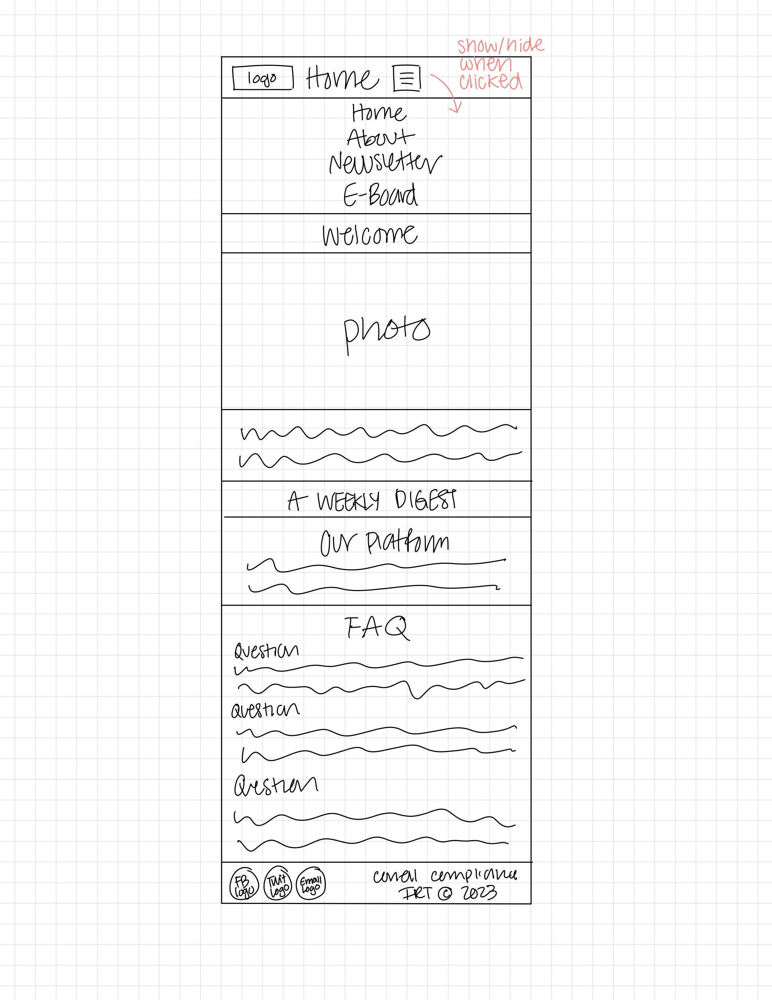

Explanation: The idea behind this sketch was to allow for the website visitor's to immediately understand what IRT stood for. Thus, the navigation menu includes labels like home, about, newsletter, and e-board. The navigation menu is placed at the top of the screen, in the form of a hamburger menu, since this is customarily the way that websites are structured. This commonly used format facilitates navigation.

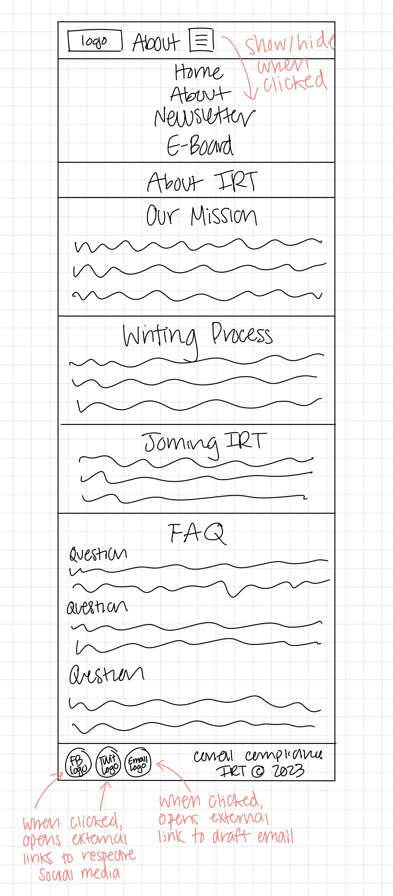

Explanation: The idea behind the about page sketch was to provide the necessary information for visitors to understand what IRT stands for and how they can get involved. Nonetheless, to make this content easily accessible on narrow screens, all the information is stacked (including the aside). This stacking is commonly done on websites to optimize the screen space. As previously mentioned, the navigation bar (along with the logo) is placed at the top of the screen, as is commonly done across websites. At the bottom of the page, users are able to find important information about ways to contact IRT, and their social media platforms. The footer also includes copyright content, which is normally found across most websites.

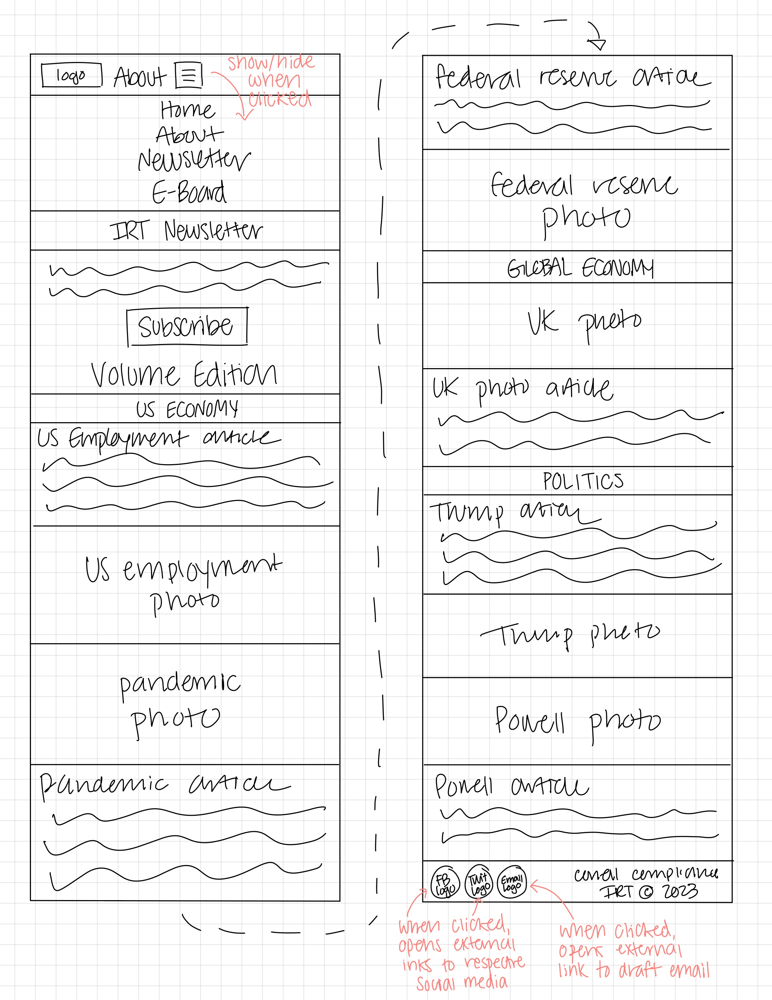

Explanation: The idea behind the about page sketch was to provide the necessary information for visitors to get an idea of the past newsletters that IRT has published. Nonetheless, to make this content easily accessible on narrow screens, all the information is stacked (including the aside). This stacking is commonly done on websites to optimize the screen space. The navigation bar and footer are the same on all pages, as commonly practiced.

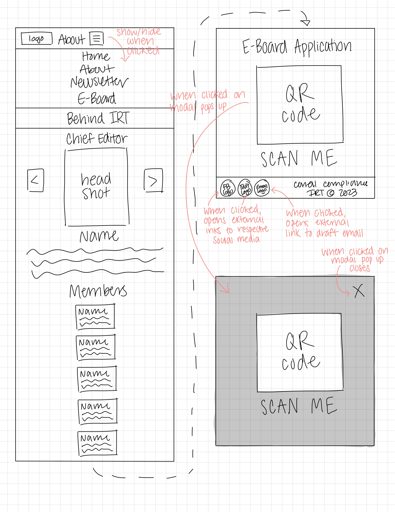

Explanation: This sketch features the commonly seen stacked content for narrow screens. The content on this page presents users with the necessary information about E-board. Nonetheless, to optimize the screen space, a carrousel was implemented. To allow for users to easily apply for E-board positions, a modal was used for the QR code. The footer and navigation bar remains the same.

**Wide Design:**
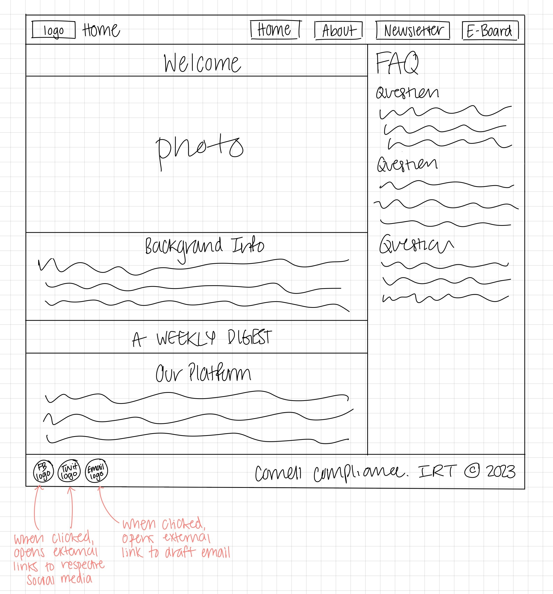

Explanation: The home page has the same content in both the wide version and the narrow version; it is a common practice to make sure that the audience can access all information regardless of their device. Instead of being stacked, most of the content is now seen side by side in order to make the most of the screen space. Thus, the navigation bar is now at the top of the page in a horizontal format, instead of a vertical one. The footer stayed the same.

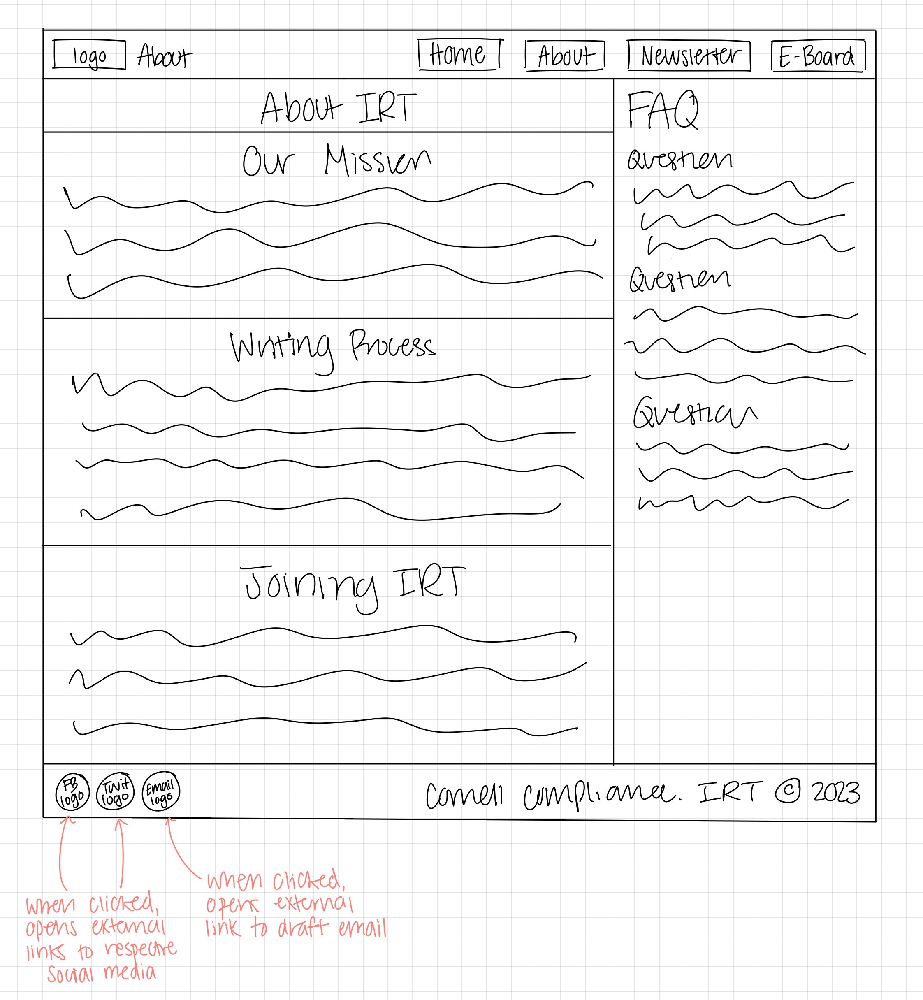

Explanation: The about page features a similar format as the home page. That is because the main content is found beside the aside; this is a common practice for wide screen layouts. For consistency reasons, the navigation bar and footer are kept the same on all pages.

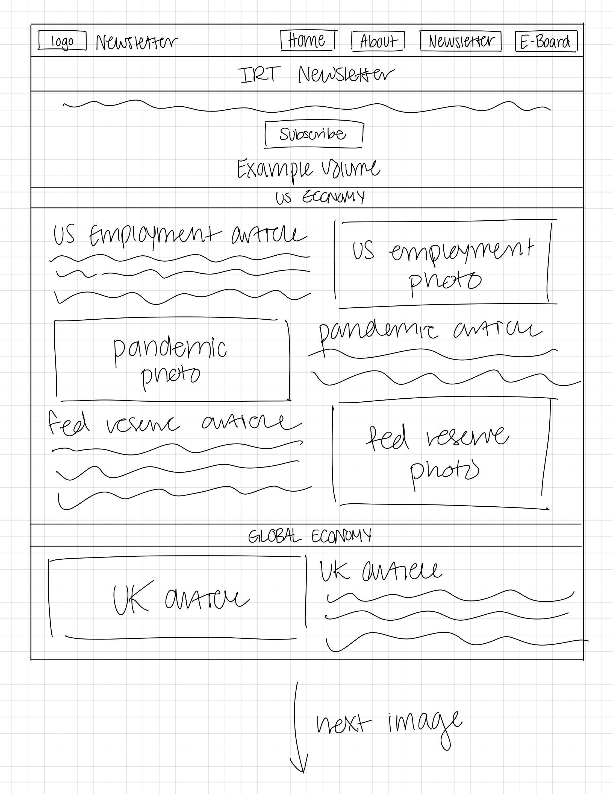

Explanation: The newsletter page opens with a horizontal navigation menu at the top of the screen, making it easily accessible. The content below that is arranged in a Z-pattern; thus, the images are placed beside the content that corresponds to them. The Z-pattern was implemented because it was proposed by one of the individuals who were interviewed. At the end of the screen, users can find the footer with the same content across all pages; the content repetition in the footer is a common practice.

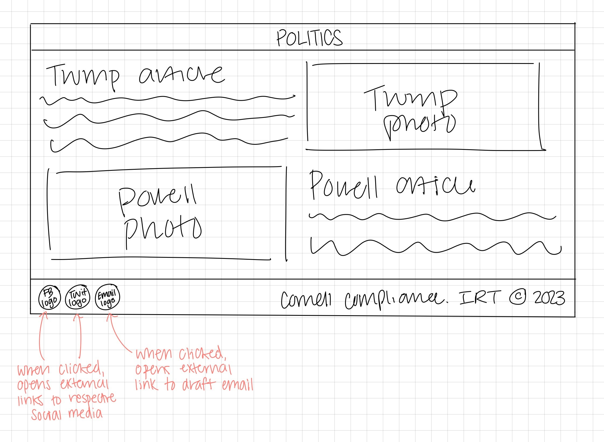

Explanation: This is a continuation of the newsletter sketch. As you can see  the Z-pattern continues throughout the page. At the end, the footer is visible; the user is able to interact with the icons within the footer. The interaction allows for the user to access IRT's social media platforms or contact the E-board (if they have unanswered questions).

Explanation: The sketch was implemented to make it clear as to how users should interact with the carrousel. It is imperative for this to be known in order for all the content to be accessed. The carrousel is an interactive component used across most websites to make the most of the screen space.

Explanation: This sketch outlines the look and feel of the QR code modal. This modal was implemented in order to allow for users to expand the QR code to easily scan it and apply for an E-board position. Using modals for important content is a common practice.

<cite> Layout Exploration </cite> by Ingrid Gruener and Elaine Wu

### Final Design (Milestone 2)
> Include the final sketches for each of your pages.
> **Include your final interactivity in your sketches.** Include annotations to explain what happens when the user takes an action with your interactivity.
> The sketches must include enough detail that another 1300 student could implement them.
> Please provide an explanation for each sketch.

**Narrow Design:**

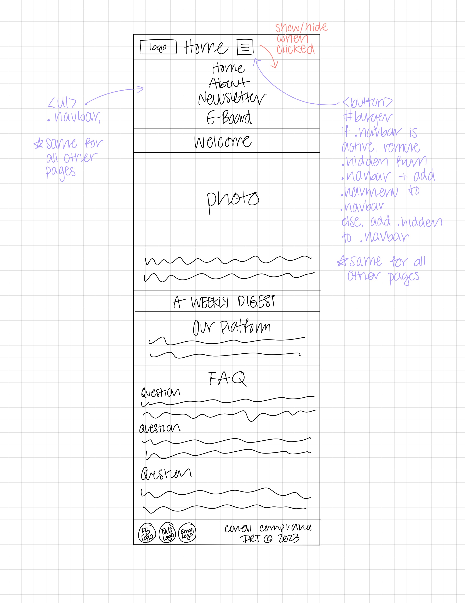

Explanation: The sketch shows the coding elements that were used for the narrow home page. The divs and classes that were implemented allowed for the content to be stacked to make the most of the screen space. The navigation coding elements made it possible to change between the wide navigation and narrow navigation.

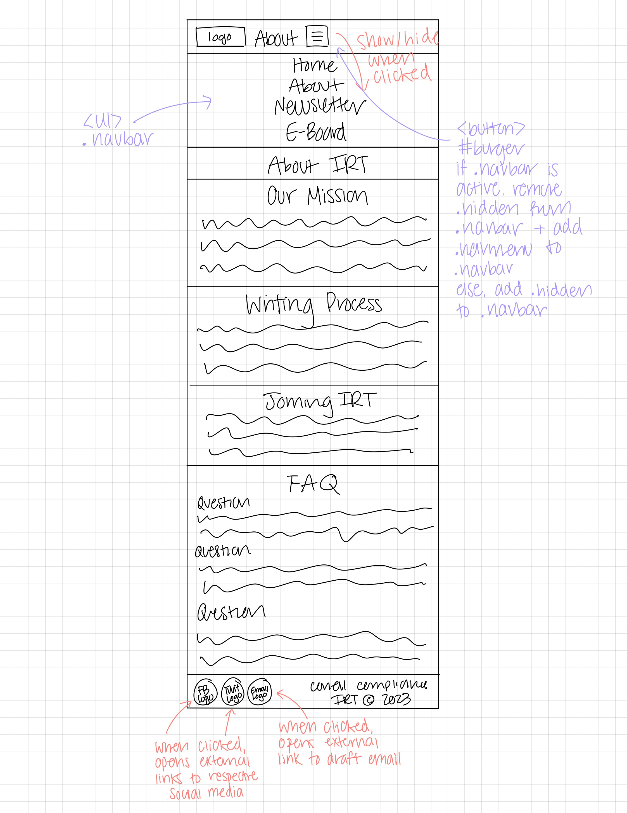

Explanation: The same classes and elements were used to code the about page for consistency. The narrow page features a stacked content layout to make the most of the screen space as a means of making the website easy to navigate. Thus, the content is organized in a hierarchical order wherein the most important content is placed toward the top (i.e., the club's mission) and the content gets less important as the page continues. The page closes with the same footer that is found on all the website's pages.

Explanation: The narrow newsletter page contains stacked content paired with the appropriate images. Specifically, the text is followed by a visual element that summarizes what the paragraph discusses. In order to accomplish this parent and child elements were used. Near the top of the page, there is a subscribe button that allows users to easily subscribe to the newsletter if they seem to be interested in the content. Again, the footer and navigation bar are the same on all pages to make the website user-friendly and easy to navigate.

Explanation: The e-board page contains all the information that is necessary for a user to understand how the club's e-board functions. Thus, the first piece of content is a carousel with images of the head e-board members, followed by a description of their personal experiences being part of the club. After the modal, there is a section of the page with the names, majors, and years of the other e-board members of the club. At the end of the page, users are given access to a QR code that leads to an external google forms with an E-board application; this QR code is coded in the form of a modal to make it easier for user to scan it. As previously stated, this page contains the same hamburger menu and footer as the other pages.

**Wide Design:**

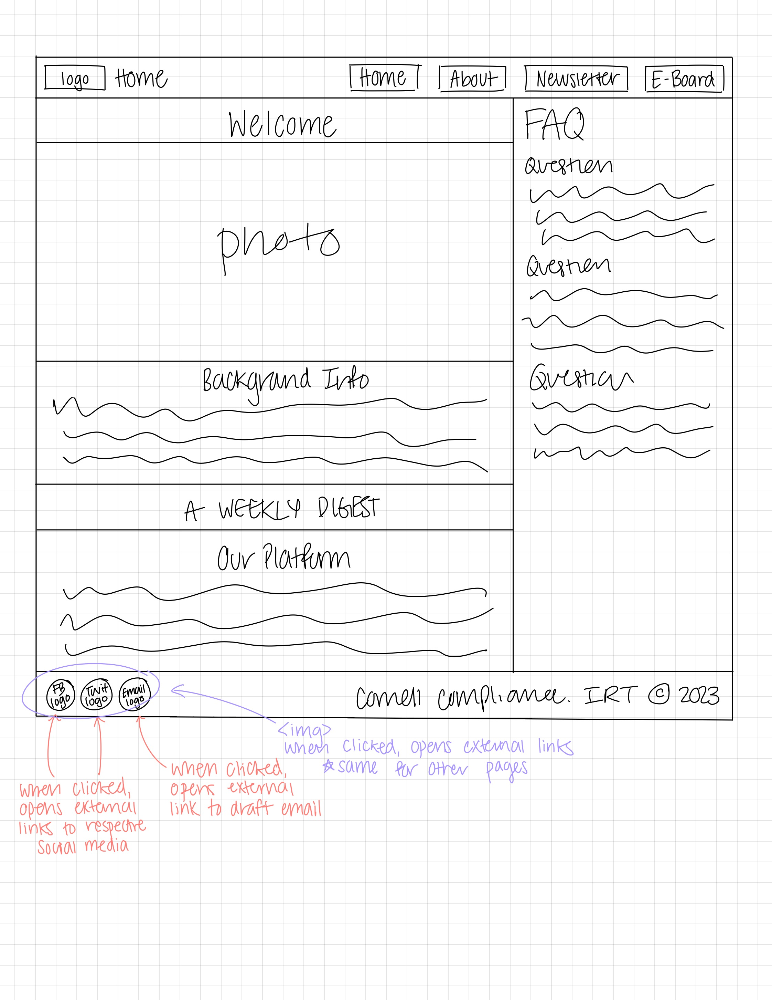

Explanation: The wide design features the same content as the narrow design; nonetheless, this page is organized with the content side by side instead of on top of one another. Specifically, the page opens with a horizontal navigation bar (which is the same across all the wide screen pages). After the navigation bar, the user immediately sees the club's logo for branding reasons and clarity; in other words, this lets the website's visitor know that the website will cover information about IRT. The text content on this page provides user with a summary of the club, and more information that acts as an overview of what they can expect when navigating the website. The main content, mentioned previously, is placed beside a sidebar with frequently asked questions. Because this page contains the same content, the same classes and elements were used to code this page as the narrow version for consistency. At the end of the page, the user will see a footer with buttons that link to the club's social media platforms and contact information.

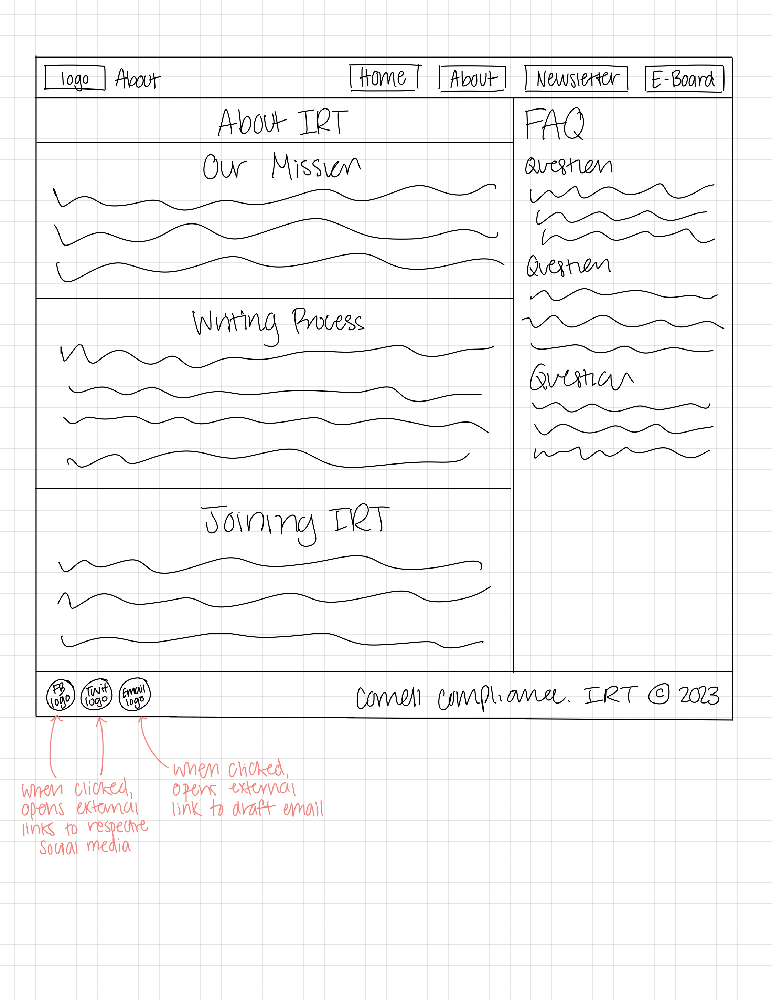

Explanation: Like the website's home page, the About Us page features a side-by side content organization wherein the main content is placed beside the side bar. The main content on this page provides an overview of the club's offerings and what the club stands for. On the other hand, the side bar gives users answers to questions they may have about the club. Nonetheless, since the same content is featured on the wide screen version, the same classes and elements were used to code this page as the narrow version for consistency. At the bottom of the page, the user is able to see the same footer, with the buttons, for consistency and easy navigation.

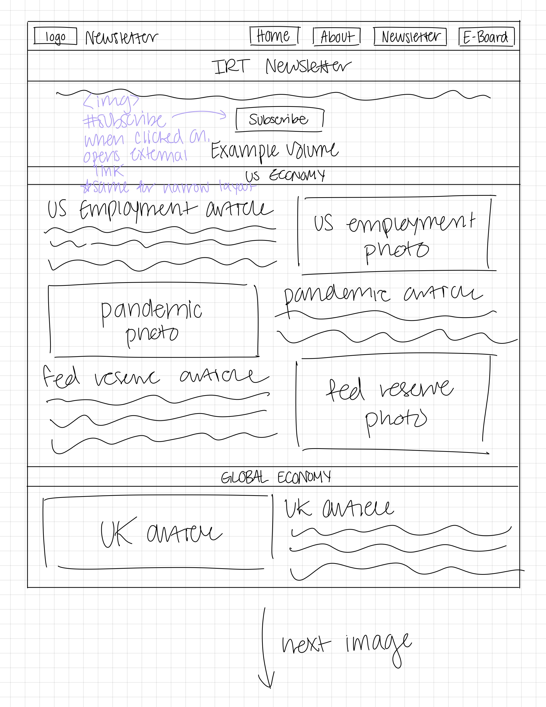

Explanation: As seen in the narrow screen version, the page opens with an sentence overview of the club's newsletter, followed by an image button that allows users to immediately subscribe to the newsletter. After the button, there is an example of one of the past newsletters, paired with images that complement its content. The content is organized in a Z-format, as suggested by one of the interviewees. At the top of the page, the user will find the navigation bar.

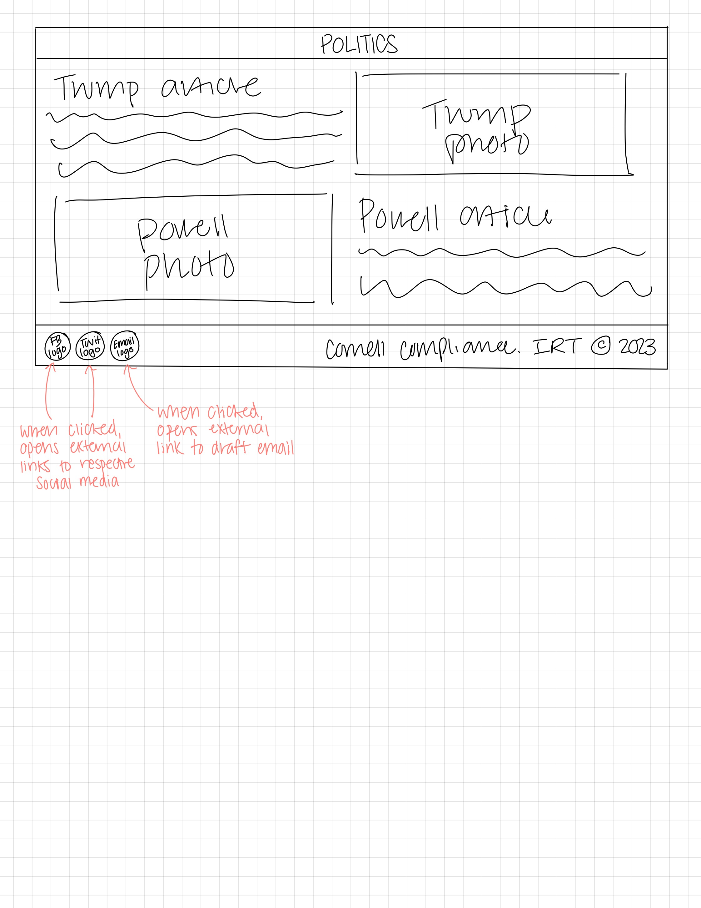

Explanation: This image is a continuation of the previous sketch of the newsletter page. Thus, this image solely outlines the bottom of the page. That being said, at the bottom of the page, the visitor will be able to access the footer, with buttons that allow them to further engage with the club. The same classes and elements were used to code this page, as the narrow version, for consistency.The same classes and elements were used to code this page  as the narrow version for consistency.

Explanation: This page is dedicated to providing information about the club's E-board. Thus, to make the most of the space on tha page, a carousel was implemented with images (and the experiences) of the two main board members. The carousel contains arrows on either side to make for an intuitive user experiences. Following that, there is a list of the other e-board members of the club. At the top of the page, users will find the same navigation bar. Due to the fact that the wide version design contains the same content, the same classes and elements were used to code this page as the narrow version for consistency.

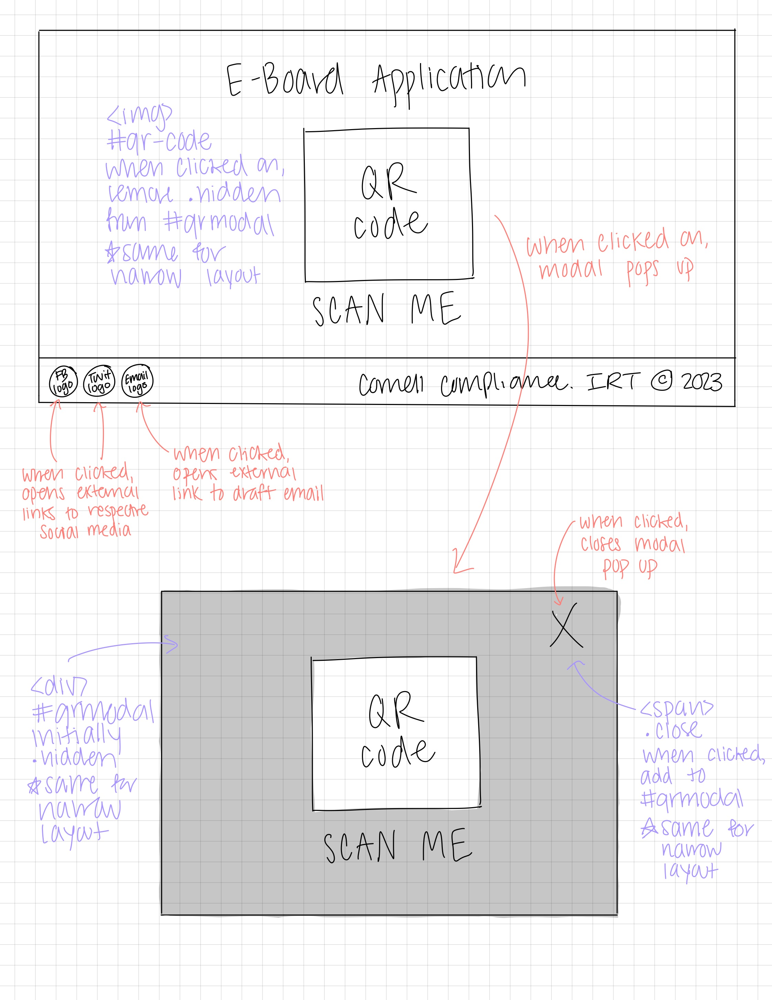

Explanation: This image contains a continuation of the E-board page sketch above. Near the bottom of the page, users will come across a QR code that, if scanned, takes them to an external google forms to apply. Nonetheless, to make it easier for users to scan this image, it has been coded in the form of a modal. The same classes and elements were used to code this page as the narrow version for consistency. At the end of the page, the users are able to see the footer, with buttons that allow them to contact the club and/or connect with them through social media.

<cite> Layout Exploration </cite> by Ingrid Gruener and Elaine Wu

### Design Rationale (Milestone 2)
> Explain why your design is appropriate for your audience.
> Specifically, why does your content organization, navigation, and site design/layout meet the goals of your users?
> How did you employ **design patterns** to improve the familiarity of the site for your audience?

The website's content is organized into clearly labeled pages: Home, E-board, About, and Newsletter. This structure was chosen as it directly caters to the primary interests of the audience. By segmenting content into these categories, the site permits students to quickly find information relevant to their goals, promoting efficient and targeted browsing. The navigation is designed to be concise and user-friendly, employing a top navigation bar that remains consistent across all pages. This design pattern is familiar to most users, reducing the learning curve and user experience. Such ease of navigation is crucial for students who are often time-constrained and seeking quick information about the club. Additionally, the use of an aside is popular among websites to display brief information to the users. without requiring them to scour the website for it. The layout is clean and minimalistic, with a focus on readability and ease of use, reflecting the theme of the club. This design choice was intended to appeal to the audience's intellectual curiosity, presenting content in an uncluttered, focused manner. Moreover, the use of the club's colors (red, grey, and white) in the design maintains brand consistency and creates a visually appealing aesthetic that remains cohesive with the club's existing identity. Familiar design patterns have been employed, such as a prominently displayed header containing the page title and navigation bar, a footer with additional links and information, and an aside with frequently asked questions. By using these patterns, the website offers a sense of familiarity, making it easier for users to navigate and interact with the site. Using visual cues like icons for different sections and buttons, such as the hamburger menu, also helps make the site more intuitive and user-friendly.

<cite> Design Rationale </cite> by Edward Conte.

## Interactivity Rationale (Milestone 2)
> Describe the purpose of your proposed interactivity.
> Provide a brief rationale explaining how your proposed interactivity addresses the goals of your site's audience and enhances their user experience.

When the user is reading the website on a small screen, the hamburger menu icon will appear, prompting the user to press it for the navigation menu. Implementing a hamburger menu will improve information accessibility by optimizing the limited screen space of the narrow layout. This facilitates visitors' traversal of the website and improves the usability of this website regardless of the device they are searching on. This Interaction fulfills a key audience goal: for the website to have straightforward navigation and a user-friendly design.

An image carousel will be implemented, allowing the user to view images of the co-presidents of the club and their contact information on the E-board page. Under their information, users can also cycle through short snippets from the presidents. The navigation of the carousel will be familiar to users through interactive arrow buttons, which clearly communicate their purpose. The interactive image carousel will advance users toward their goal of getting to know the club e-board through its presentation of their photos and writing.

On the newsletter page, which presents an example of the club’s articles, an interactive button will lead users to a separate page where they are encouraged to fill out their information to sign up for the club email newsletter. This fulfills a major audience goal of locating how to engage with the club through the newsletter subscription.

Throughout the website, the footer will contain icons leading to the club’s Facebook, Twitter, and Gmail. Users will be able to interact with these buttons to engage with IRT club members on said platforms, enhancing club outreach and engagement with the club. This will benefit the audience by bringing them closer to their goals and the club by bringing attention to their other platforms and facilitating communication with potential members.
A large QR-code image will be placed on the e-board page, prompting users to click it based on visual cues (curser pointer changing). When this button is clicked, the QR code will enlarge, permitting users to scan the code with another device or scanning program. When the code is scanned, users will be led to the IRT e-board application. Implementing this interactivity provides users with additional information regarding the application process, promotes interaction with IRT, and enhances user experience and accessibility on the website.

<cite> Interactivity Rationale </cite> by Edward Conte.

## Interactivity Plan (Milestone 2)
> Now that you've designed your interactivity for your site, you need to plan how you will implement it.
> Describe how you will implement the interactivity. This should be a complete plan that another 1300 student could use to implement the interactivity.
> You should list the HTML elements, CSS classes, events, pseudocode, and the initial state.

**Interactivity Plan Sketches**
Home Page Narrow Initial State:
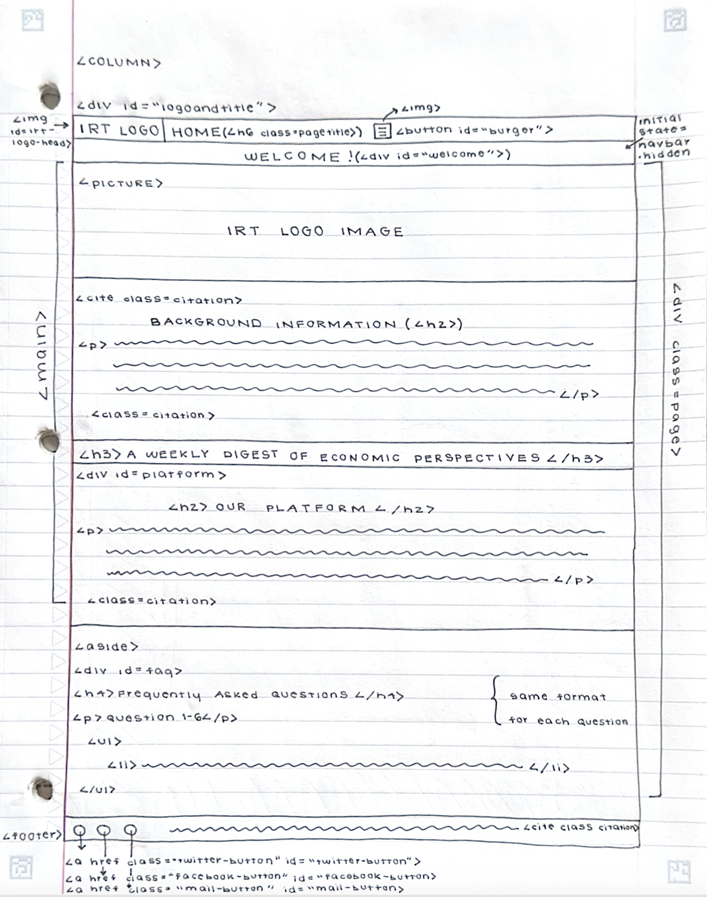

Home Page Narrow Final State:
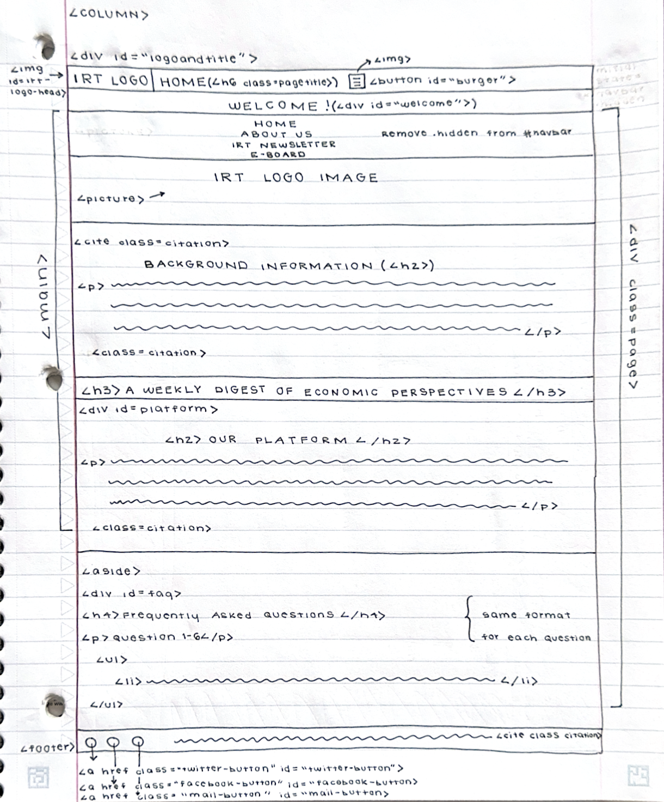

Home Page Wide:
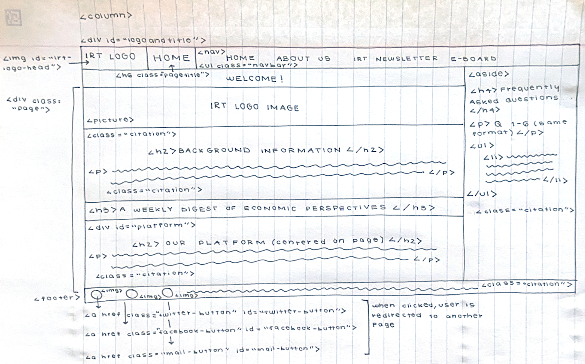

About Us Page Narrow Initial State:

About Us Page Narrow Final State:
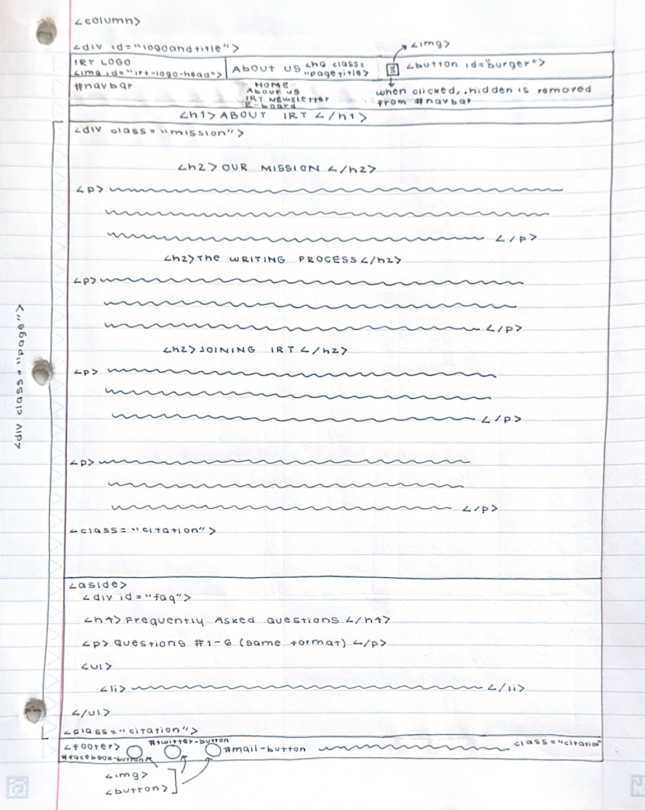

About Us Page Wide:

Newsletter Page Narrow Initial State Part 1:
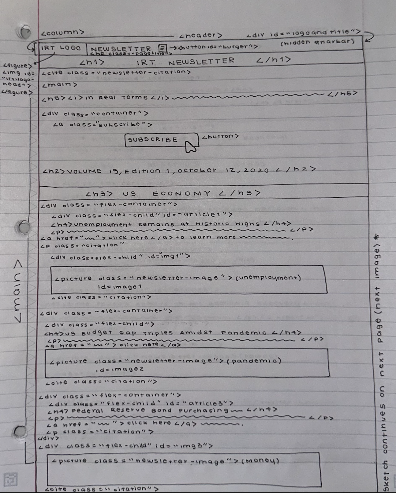

Newsletter Page Narrow Initial State Part 2:
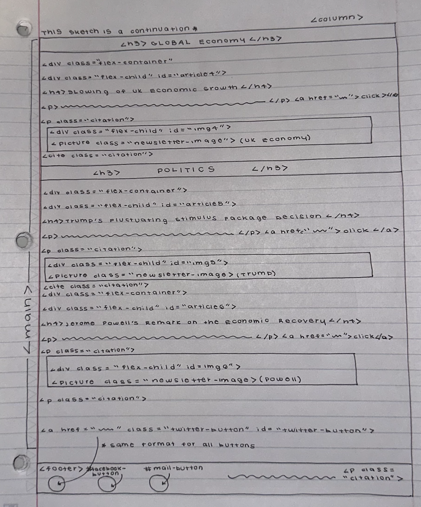

Newsletter Page Narrow Final State:
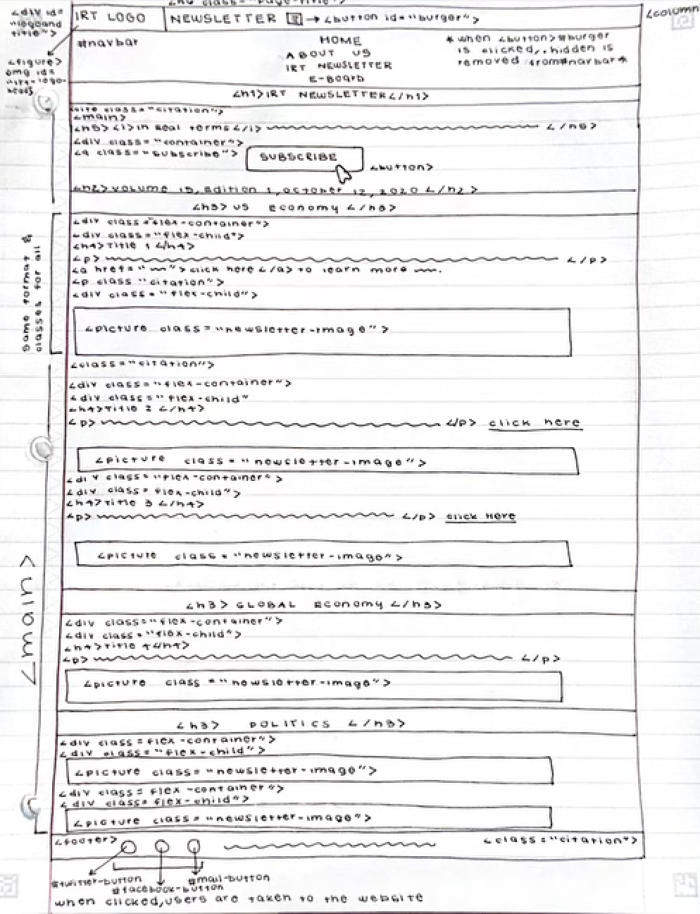

Newsletter Page Wide:

E-Board Page Narrow Initial State:

E-Board Page Narrow Final State:

E-Board Page Wide:

**HTML Elements:**
1. head
2. link
3. meta
4. title
5. body
6. header
7. div
8. figure
9. img
10. h6
11. button
12. nav
13. ul
14. li
15. a
16. h1
17. aside
18. h4
19. p
20. main
21. h2
22. footer
23. cite
24. script
25. aside
26. h3
27. picture
28. h5
29. i

**CSS Classes:**
1. .container
2. .flex-container
3. .flex-child
4. .title-citation
5. .citation
6. .pagetitle
7. .navbar
8. .navbar li
9. .navbar a
10. .navbar a:hover
11. .subscribe
12. .subscribe:hover
13. .newsletter-citation
14. .close
15. .close:hover, .close:focus
16. .page
17. .main
18. .aside
19. #faq p
20. #faq li
21. .e-board-page main
22. .chief-editors
23. .chief-editors-content
24. .chief-editor-desc
25. .chief-editor-desc h4
26. .chief-editor-desc p
27. .e-board-page main img
28. .members-content-row
29. .member-description
30. .members ul
31. .member-name
32. .left-arrow-button
33. .right-arrow-button
34. .qr-code
35. .twitter-button
36. .facebook-button
37. .mail-button
38. .navmenu
39. .navmenu *
40. #burger img
41. .hidden
42. .hidden *

**Events:**
- Clickable Elements:
  - subscribe button
  - mail button
  - facebook button
  - twitter button
- Hover Effect
  - navigation bar
- Responsive Design Adjustments
  - Below 900 pixels, content becomes stacked
  - Below 900 pixels, aside becomes stacked
  - Below 900 pixels, hamburger menu appears
- JavaScript Interactions:
  - Modal for QR Code
  - Carrousel (changes images alone)
  - Hamburger Menu

**Navigation Pseudocode:**
Function hide_nav:
    If window's width is less than or equal to 900:
        Add "hidden" to #navbar
    Else:
        Remove "hidden" from #navbar
        Add #navmenu to #navbar

When #burger is clicked:
    If #navbar has "hidden":
        Remove "hidden" from #navbar
        Add #navmenu to #navbar
    Else:
        Add "hidden" to #navbar

**Carrousel Pseudocode:**
Set an interval that repeats every 7000 milliseconds:
    If #joel-pang has "hidden":
        Remove "hidden" from #joel-pang
        Add "hidden" to #noah-cordon-siskind
    Else:
        Add "hidden" to #joel-pang
        Remove "hidden" from #noah-cordon-siskind

When #left-arrow-button is clicked:
    If #joel-pang has "hidden":
        Remove "hidden" from #joel-pang
        Add "hidden" to #noah-cordon-siskind
    Else:
        Add "hidden" to #joel-pang
        Remove "hidden" from #noah-cordon-siskind

When #right-arrow-button is clicked:
    If #joel-pang has "hidden":
        Remove "hidden" from #joel-pang
        Add "hidden" to #noah-cordon-siskind
    Else:
        Add "hidden" to #joel-pang
        Remove "hidden" from #noah-cordon-siskind

**Subscribe Button Pseudocode:**
When #subscribe is clicked:
    Set href to "https://cornell.us15.list-manage.com/subscribe?id=63fa7e7323&u=95184ae5551472d32c2d92686"

**Modal Pseudocode:**
When #qr is clicked:
    Remove "hidden" from #qrmodal

When #close is clicked:
    Add "hidden" to element with #qrmodal

**Initial State:**
- Wide Navigation Bar present
  - hamburger menu is hidden
- Aside next to the main content
- Carrousel
  - One image showing up

<cite> Interactivity Plan </cite> by Ingrid Gruener.

## Client Feedback & Minutes (Milestone 2)
> You should meet with your client again to obtain feedback on your design.
> Provide a summary of the client's feedback and your meeting's minutes.

The completed site was shown to the client, and they were asked to check through the site, review the site's text sections, images, and sections. Once the client skimmed the pages and interacted with the javascript interactivity on their own pace, a teammember walked the client through the the site and reviewed each page with them. The client was impressed with the professionalism of each page and the cohesiveness of the site with their vision and intentions for the site. The team member reviewed the interactivity of the site with the client and explained how each interaction related to the goals of the audience discovered through user interviews. The client agreed with the goals and was particularly excited about the implementation of elements that encourage users to interact with members of the IRT team and potentially join the club.

Minutes:
- the review with the client lasted approximatly 7 minutes
- the client was impressed with how we implemented interactivity for the goals
- the client agreed with the audience's goals

<cite> Client Feedback & Minutes </cite> by Eddie Conte.

## User Testing (Final Submission)

**Conduct user testing with a minimum of 1 participant for every member of your team.**

### User Testing Tasks (Final Submission)
> Plan out your user testing tasks before doing your user testing.
> These must be actual user testing tasks.
> **Tasks are not questions!**

1. Task 1: Navigate to the 'About Us' page to read about the club's mission, values, and history.

2. Task 2:  Browse the Frequently Asked Questions.

3. Task 3: Locate and view the past newsletter issue.

4. Task 4: Subscribe to the IRT Newsletter.

5. Task 5: View the profiles of current e-board members, including their roles and contributions.

6. Task 6: Use the provided QR code to access the E-Board Application.

7. Task 7: Use the integrated social media buttons to follow the club on various platforms.

TODO: add more tasks if necessary (a good rule of thumb is a task for every user goal)

<cite> User Testing Tasks </cite> by Ingrid Gruener.

### Participant 1 (Final Submission)
> Using your notes from above, describe your user by answering the questions below.

1. Who is your user, e.g., where does the user come from, what is the user's job, characteristics, etc.?

    TODO: tell us about the participant

2. Does the user belong to your audience of the site?

    > If “No”, what’s your strategy of associating the user test results to your audience’s needs and wants? How can your re-design choices based on the user tests make a better fit for the audience?

    TODO: (Yes / No)

### Participant 1 -- Testing Notes (Final Submission)
> When conducting user testing, you should take notes during the test.

TODO: participant user test notes

### Participant 2 (Final Submission)
> Using your notes from above, describe your user by answering the questions below.

1. Who is your user, e.g., where does the user come from, what is the user's job, characteristics, etc.?

    TODO: tell us about the participant

2. Does the user belong to your audience of the site?

    > If “No”, what’s your strategy of associating the user test results to your audience’s needs and wants? How can your re-design choices based on the user tests make a better fit for the audience?

    TODO: (Yes / No)

### Participant 2 -- Testing Notes (Final Submission)
> When conducting user testing, you should take notes during the test.

TODO: participant user test notes

### Participant 3 (Final Submission)
> Using your notes from above, describe your user by answering the questions below.

1. Who is your user, e.g., where does the user come from, what is the user's job, characteristics, etc.?

    TODO: tell us about the participant

2. Does the user belong to your audience of the site?

    > If “No”, what’s your strategy of associating the user test results to your audience’s needs and wants? How can your re-design choices based on the user tests make a better fit for the audience?

    TODO: (Yes / No)

### Participant 3 -- Testing Notes (Final Submission)
> When conducting user testing, you should take notes during the test.

TODO: participant user test notes

TODO: add more participants if necessary

## Website Revision Based on User Testing (Final Submission)
> What changes did you make to your design based on user testing?

TODO: explain the revisions to your website from user testing

## Grading (Final Submission)

### Collaborators (Final Submission)
> List any persons you collaborated with on this project.

TODO: list your collaborators

### Reference Resources (Final Submission)
> Please cite any external resources you referenced in the creation of your project.
> (i.e. tutorials, W3Schools, StackOverflow, Mozilla, etc.)

- https://www.scaler.com/topics/image-button-in-html/
- https://www.washington.edu/accesscomputing/webd2/student/unit6/module2/lesson1.html#:~:text=A%20Typical%20Usability%20Test&text=Ask%20the%20users%20to%20perform,cart%20and%20proceed%20to%20checkout

TODO: list reference resources
